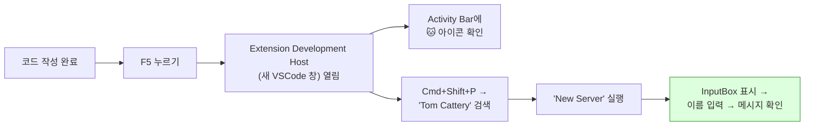

# Tom Cattery - Getting Started

## 0. 사전 준비

### 필수 설치

| 도구 | 버전 | 확인 명령 | 설치 |
|------|------|----------|------|
| **Node.js** | 18.x 이상 | `node -v` | https://nodejs.org |
| **npm** | 9.x 이상 | `npm -v` | Node.js에 포함 |
| **VSCode** | 1.85+ | `code -v` | https://code.visualstudio.com |
| **Java JDK** | 11 이상 | `java -version` | 테스트용 Tomcat 실행에 필요 |
| **Apache Tomcat** | 9.x / 10.x | — | https://tomcat.apache.org (로컬에 1개 이상) |

### 선택 설치

| 도구 | 용도 | 설치 |
|------|------|------|
| `yo` + `generator-code` | Extension 프로젝트 생성기 | `npm install -g yo generator-code` |
| `@vscode/vsce` | Marketplace 패키징/배포 | `npm install -g @vscode/vsce` |

---

## 1. 프로젝트 생성

### 방법 A: yo code 사용 (권장)

```bash
# 생성기 설치 (최초 1회)
npm install -g yo generator-code

# 프로젝트 생성
yo code

# 아래와 같이 선택:
#   ? What type of extension do you want to create?
#     → New Extension (TypeScript)
#   ? What's the name of your extension?
#     → Tom Cattery
#   ? What's the identifier of your extension?
#     → tom-cattery
#   ? What's the description of your extension?
#     → 🐱 Tomcat Server Manager for VSCode - raise your Tomcats in one place
#   ? Initialize a git repository?
#     → Yes
#   ? Which bundler to use?
#     → esbuild
#   ? Which package manager to use?
#     → npm

cd tom-cattery
```

### 방법 B: 수동 생성

```bash
mkdir tom-cattery && cd tom-cattery
npm init -y
git init
```

---

## 2. 의존성 설치

```bash
# 런타임 의존성
npm install fast-xml-parser adm-zip portfinder

# 개발 의존성
npm install -D typescript @types/vscode @types/node @types/adm-zip
npm install -D @vscode/test-electron esbuild @vscode/vsce
```

---

## 3. 프로젝트 구조

yo code가 생성한 기본 구조에서 아래와 같이 확장한다:

```
tom-cattery/
├── .vscode/
│   ├── launch.json              ← F5 디버그 실행 설정
│   ├── tasks.json               ← 빌드 태스크
│   └── settings.json
│
├── src/
│   ├── extension.ts             ← 진입점 (activate / deactivate)
│   │
│   ├── types/
│   │   └── index.ts             ← 인터페이스 정의
│   │
│   ├── core/
│   │   ├── RuntimeManager.ts    ← Tomcat 런타임 감지/다운로드
│   │   ├── InstanceManager.ts   ← CATALINA_BASE 생성/관리
│   │   ├── ProcessManager.ts    ← Tomcat 프로세스 start/stop
│   │   ├── DeployManager.ts     ← WAR exploded 배포
│   │   ├── DebugController.ts   ← JPDA + 디버거 auto-attach
│   │   ├── ConfigParser.ts      ← server.xml 파싱/패치
│   │   └── LogStreamer.ts       ← catalina.out 실시간 출력
│   │
│   ├── commands/
│   │   ├── serverCommands.ts    ← New/Start/Stop/Restart/Debug
│   │   ├── deployCommands.ts    ← Deploy/Redeploy
│   │   └── runtimeCommands.ts   ← Add Runtime/Remove Runtime
│   │
│   └── views/
│       ├── ServerTreeProvider.ts    ← 사이드바 TreeView
│       └── ConfigWebviewProvider.ts ← 서버 설정 폼 UI
│
├── resources/
│   └── tom-cattery.svg          ← Activity Bar 아이콘
│
├── package.json                 ← ⭐ Extension 선언부 (가장 중요)
├── tsconfig.json
├── esbuild.js                   ← 번들링 설정
├── .vscodeignore
│
├── CLAUDE.md                    ← Claude Code 컨텍스트
├── tom-cattery-design.md        ← 전체 설계 문서
├── tom-cattery-techstack-guide.md ← 기술 스택 가이드
└── GETTING_STARTED.md           ← 이 파일
```

---

## 4. 핵심 파일 설정

### 4.1 tsconfig.json

```json
{
  "compilerOptions": {
    "module": "commonjs",
    "target": "ES2022",
    "lib": ["ES2022"],
    "sourceMap": true,
    "rootDir": "src",
    "outDir": "out",
    "strict": true,
    "esModuleInterop": true,
    "skipLibCheck": true,
    "forceConsistentCasingInFileNames": true,
    "resolveJsonModule": true
  },
  "exclude": ["node_modules", ".vscode-test"]
}
```

### 4.2 .vscode/launch.json

```json
{
  "version": "0.2.0",
  "configurations": [
    {
      "name": "Run Extension",
      "type": "extensionHost",
      "request": "launch",
      "args": [
        "--extensionDevelopmentPath=${workspaceFolder}"
      ],
      "outFiles": ["${workspaceFolder}/out/**/*.js"],
      "preLaunchTask": "${defaultBuildTask}"
    }
  ]
}
```

### 4.3 .vscode/tasks.json

```json
{
  "version": "2.0.0",
  "tasks": [
    {
      "type": "npm",
      "script": "watch",
      "problemMatcher": "$tsc-watch",
      "isBackground": true,
      "presentation": { "reveal": "never" },
      "group": { "kind": "build", "isDefault": true }
    }
  ]
}
```

### 4.4 package.json (핵심 contributes 섹션)

```json
{
  "name": "tom-cattery",
  "displayName": "Tom Cattery",
  "description": "🐱 Tomcat Server Manager for VSCode - raise your Tomcats in one place",
  "version": "0.0.1",
  "engines": { "vscode": "^1.85.0" },
  "categories": ["Other"],
  "activationEvents": [],
  "main": "./out/extension.js",
  "scripts": {
    "vscode:prepublish": "npm run compile",
    "compile": "tsc -p ./",
    "watch": "tsc -watch -p ./",
    "lint": "eslint src --ext ts",
    "package": "vsce package",
    "publish": "vsce publish"
  },
  "contributes": {
    "viewsContainers": {
      "activitybar": [
        {
          "id": "tom-cattery",
          "title": "Tom Cattery",
          "icon": "resources/tom-cattery.svg"
        }
      ]
    },
    "views": {
      "tom-cattery": [
        {
          "id": "tomCattery.servers",
          "name": "Servers"
        }
      ]
    },
    "commands": [
      {
        "command": "tomCattery.addServer",
        "title": "Tom Cattery: New Server",
        "icon": "$(add)"
      },
      {
        "command": "tomCattery.addRuntime",
        "title": "Tom Cattery: Add Runtime"
      },
      {
        "command": "tomCattery.startServer",
        "title": "Tom Cattery: Start Server",
        "icon": "$(play)"
      },
      {
        "command": "tomCattery.stopServer",
        "title": "Tom Cattery: Stop Server",
        "icon": "$(debug-stop)"
      },
      {
        "command": "tomCattery.restartServer",
        "title": "Tom Cattery: Restart Server",
        "icon": "$(debug-restart)"
      },
      {
        "command": "tomCattery.debugServer",
        "title": "Tom Cattery: Debug Server",
        "icon": "$(bug)"
      },
      {
        "command": "tomCattery.deploy",
        "title": "Tom Cattery: Deploy",
        "icon": "$(cloud-upload)"
      },
      {
        "command": "tomCattery.redeployAll",
        "title": "Tom Cattery: Redeploy All"
      },
      {
        "command": "tomCattery.openConfig",
        "title": "Tom Cattery: Edit Configuration",
        "icon": "$(gear)"
      },
      {
        "command": "tomCattery.openLogs",
        "title": "Tom Cattery: Open Logs",
        "icon": "$(output)"
      },
      {
        "command": "tomCattery.deleteServer",
        "title": "Tom Cattery: Delete Server",
        "icon": "$(trash)"
      }
    ],
    "menus": {
      "view/title": [
        {
          "command": "tomCattery.addServer",
          "when": "view == tomCattery.servers",
          "group": "navigation"
        }
      ],
      "view/item/context": [
        {
          "command": "tomCattery.startServer",
          "when": "view == tomCattery.servers && viewItem == server-stopped",
          "group": "inline@1"
        },
        {
          "command": "tomCattery.debugServer",
          "when": "view == tomCattery.servers && viewItem == server-stopped",
          "group": "inline@2"
        },
        {
          "command": "tomCattery.stopServer",
          "when": "view == tomCattery.servers && viewItem =~ /server-(running|debugging)/",
          "group": "inline@1"
        },
        {
          "command": "tomCattery.restartServer",
          "when": "view == tomCattery.servers && viewItem =~ /server-(running|debugging)/",
          "group": "inline@2"
        },
        {
          "command": "tomCattery.deploy",
          "when": "view == tomCattery.servers && viewItem =~ /server-.*/",
          "group": "1_actions@1"
        },
        {
          "command": "tomCattery.openConfig",
          "when": "view == tomCattery.servers && viewItem =~ /server-.*/",
          "group": "2_config@1"
        },
        {
          "command": "tomCattery.openLogs",
          "when": "view == tomCattery.servers && viewItem =~ /server-.*/",
          "group": "2_config@2"
        },
        {
          "command": "tomCattery.deleteServer",
          "when": "view == tomCattery.servers && viewItem =~ /server-.*/",
          "group": "3_danger@1"
        }
      ]
    }
  }
}
```

---

## 5. 첫 실행 확인 (Hello World 수준)

### 5.1 최소 extension.ts

```typescript
import * as vscode from 'vscode';

export function activate(context: vscode.ExtensionContext) {
  console.log('🐱 Tom Cattery is now active!');

  // 임시: New Server 커맨드
  const addServer = vscode.commands.registerCommand('tomCattery.addServer', async () => {
    const name = await vscode.window.showInputBox({
      prompt: 'Enter server name',
      placeHolder: 'my-web-app',
    });
    if (name) {
      vscode.window.showInformationMessage(`🐱 Server "${name}" will be created!`);
    }
  });

  context.subscriptions.push(addServer);
}

export function deactivate() {
  console.log('🐱 Tom Cattery deactivated');
}
```

### 5.2 확인 방법



**이것이 보이면 Phase 1 완료. 이후 Phase 2로 진행.**

---

## 6. Phase별 Claude Code 프롬프트 예시

### Phase 0 + 1 (프로젝트 셋업 + 빈 UI)

```
CLAUDE.md를 읽고 Phase 0 ~ Phase 1을 구현해줘.

- yo code 대신 직접 프로젝트를 scaffolding해줘
- package.json의 contributes 섹션을 tom-cattery-design.md 기반으로 완성
- 빈 ServerTreeProvider를 만들어서 Activity Bar에 🐱 Tom Cattery 뷰 표시
- "Tom Cattery: New Server" 커맨드에서 서버 이름을 InputBox로 입력받기
- F5로 실행했을 때 Activity Bar 아이콘과 커맨드가 동작하는 상태까지
```

### Phase 2 (CATALINA_BASE 생성)

```
Phase 2를 구현해줘.

- RuntimeManager: showOpenDialog로 로컬 Tomcat 경로 선택, CATALINA_HOME 검증
  (lib/catalina.jar 존재 여부로 판별)
- InstanceManager: ~/.vscode/tom-cattery/servers/{name}/ 에 CATALINA_BASE 생성
  - conf/ 복사 (server.xml 포트 패치, logging.properties 경로 패치)
  - bin/setenv.sh 템플릿 생성
  - webapps/, logs/, work/, temp/ 디렉토리 생성
  - .tom-cattery.json 메타데이터 저장
- TreeView에 생성된 서버 목록 표시 (이름 + 포트 + 상태)
- 서버 삭제 기능 (디렉토리 삭제 + TreeView 갱신)
```

### Phase 3 (기동/중지)

```
Phase 3를 구현해줘.

- ProcessManager: CATALINA_HOME, CATALINA_BASE, JAVA_HOME 환경변수 설정 후
  catalina.sh run 또는 catalina.bat run 실행 (child_process.spawn)
- LogStreamer: stdout/stderr를 vscode.OutputChannel로 실시간 스트리밍
- TreeView 상태 반영: 🟢 Running / ⚫ Stopped
- Start / Stop / Restart 커맨드 구현
- Stop은 catalina.sh stop 또는 shutdown port로 처리
- Windows에서는 catalina.bat 사용
```

### Phase 4 (WAR Exploded 배포)

```
Phase 4를 구현해줘. tom-cattery-design.md의 섹션 7을 참고.

- DeployManager: WAR 파일을 webapps/{contextDir}/ 에 exploded 배포
  - contextPath "/" → "ROOT", "/api" → "api" 매핑
  - adm-zip으로 압축 해제
  - 재배포 시 증분 배포 (CRC 비교로 변경 파일만)
- Gradle Build Hook: vscode.Task API로 빌드 태스크 실행
- Deploy / Redeploy 커맨드
- 서버 실행 중이면 context.xml 터치로 reload 트리거
```

### Phase 5 (원클릭 디버그)

```
Phase 5를 구현해줘. tom-cattery-design.md의 섹션 6을 참고.

- DebugController: 
  1. 포트 사용 가능 확인 (net.createServer)
  2. setenv.sh에 JPDA 블록 주입 (TOM CATTERY DEBUG CONFIG 마커)
  3. catalina.sh jpda run 실행
  4. JPDA 포트 리스닝 대기 (TCP 폴링, 최대 30초)
  5. vscode.debug.startDebugging()으로 Java debugger auto-attach
- Debug 세션 종료 시 자동 정리
- TreeView에 🐛 디버깅 상태 표시
- 필수 Extension (vscjava.vscode-java-debug) 없으면 설치 안내
```

---

## 7. 자주 쓰는 개발 명령어

```bash
# 빌드
npm run compile

# watch 모드 (자동 재빌드)
npm run watch

# 디버그 실행 (F5와 동일)
# → VSCode에서 F5 누르는 게 더 편함

# Extension 패키징 (.vsix 파일 생성)
vsce package

# Marketplace 배포
vsce publish

# 로컬에서 .vsix 설치 테스트
code --install-extension tom-cattery-0.0.1.vsix
```

---

## 8. 트러블슈팅

| 증상 | 원인 | 해결 |
|------|------|------|
| F5 눌러도 Extension 안 보임 | package.json contributes 누락 | views, commands 선언 확인 |
| 커맨드 검색 안 됨 | activationEvents 문제 | `"activationEvents": []` 로 설정 (항상 활성화) 또는 `"onView:tomCattery.servers"` |
| TreeView 아이콘 안 보임 | SVG 파일 없음 | resources/tom-cattery.svg 생성 또는 임시로 codicon 사용 |
| Tomcat 기동 안 됨 | JAVA_HOME 미설정 | setenv.sh에 JAVA_HOME 확인, java -version 확인 |
| Debug attach 실패 | JPDA 포트 미오픈 | catalina.sh jpda run 로그에서 "Listening for transport" 확인 |
| WAR explode 실패 | WAR 파일 경로 오류 | Gradle 빌드 후 build/libs/ 에 .war 파일 존재 확인 |
| Extension Host 크래시 | 무한 루프 또는 동기 I/O | async/await 사용, 무거운 작업은 비동기로 |

---

## 9. 참고 링크

| 자료 | URL |
|------|-----|
| VSCode Extension API 공식 | https://code.visualstudio.com/api |
| Your First Extension | https://code.visualstudio.com/api/get-started/your-first-extension |
| TreeView Guide | https://code.visualstudio.com/api/extension-guides/tree-view |
| Webview Guide | https://code.visualstudio.com/api/extension-guides/webview |
| Debug Extension Guide | https://code.visualstudio.com/api/extension-guides/debugger-extension |
| Extension Samples | https://github.com/microsoft/vscode-extension-samples |
| Publishing Extensions | https://code.visualstudio.com/api/working-with-extensions/publishing-extension |
| Codicon 아이콘 목록 | https://microsoft.github.io/vscode-codicons/dist/codicon.html |
| Tomcat CATALINA_BASE 문서 | https://tomcat.apache.org/tomcat-9.0-doc/RUNNING.txt |
