# Tom Cattery - VSCode Tomcat Manager Plugin 설계 문서

## 1. 개요

Eclipse의 Tomcat 서버 관리 수준의 편의성을 VSCode에서 제공하는 확장 프로그램.  
기존 **Community Server Connector**의 한계(설정 불편, multi-instance 관리 어려움)를 극복하고,  
**Gradle multi-project 환경**에서 여러 Tomcat 인스턴스를 독립적으로 구성·운영할 수 있도록 설계한다.

> 🐱 **Tom Cattery** — Tomcat + Cattery(고양이 사육장).  
> 여러 Tomcat 인스턴스를 한 곳에서 키우고 관리하는 사육장 컨셉.

---

## 2. 핵심 기능 요약

| 기능 | 설명 |
|------|------|
| **Tomcat Runtime 관리** | 로컬 Tomcat 선택 또는 원격 다운로드(Apache Archive) |
| **CATALINA_BASE 자동 구성** | `~/.vscode/tom-cattery/{server-name}/` 하위에 독립 인스턴스 생성 |
| **Multi-Instance 지원** | 서버별 독립 포트·설정으로 동시 기동 가능 |
| **설정 편집 UI** | server.xml, setenv.sh/bat, context.xml 등을 GUI/Form으로 편집 |
| **Start/Stop/Debug** | 커맨드 팔레트 및 TreeView에서 서버 제어, Debug attach 지원 |
| **WAR Exploded 자동 배포** | Gradle build output을 webapps에 자동 explode 배포 |
| **Hot Reload 배포** | 소스 변경 시 class/resource 자동 동기화 |
| **로그 스트리밍** | catalina.out을 VSCode Output Channel로 실시간 출력 |
| **원클릭 디버그** | JPDA 자동 구성 + VSCode Java Debugger 네이티브 연동 |

---

## 3. 아키텍처

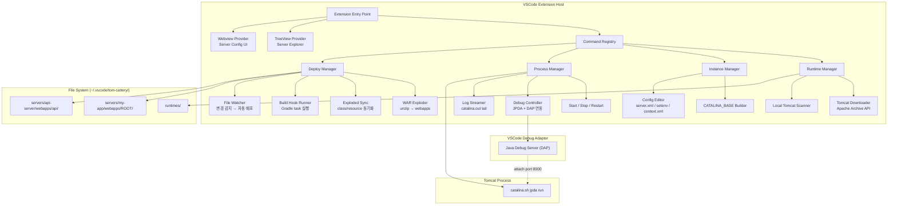
```mermaid
graph TB
    subgraph "VSCode Extension Host"
        A[Extension Entry Point] --> B[Command Registry]
        A --> C[TreeView Provider<br/>Server Explorer]
        A --> D[Webview Provider<br/>Server Config UI]
        
        B --> E[Runtime Manager]
        B --> F[Instance Manager]
        B --> G[Process Manager]
        B --> H[Deploy Manager]
        
        E --> E1[Tomcat Downloader<br/>Apache Archive API]
        E --> E2[Local Tomcat Scanner]
        
        F --> F1[CATALINA_BASE Builder]
        F --> F2[Config Editor<br/>server.xml / setenv / context.xml]
        
        G --> G1[Start / Stop / Restart]
        G --> G2[Debug Controller<br/>JPDA + DAP 연동]
        G --> G3[Log Streamer<br/>catalina.out tail]
        
        H --> H1[WAR Exploder<br/>unzip → webapps]
        H --> H2[Exploded Sync<br/>class/resource 동기화]
        H --> H3[Build Hook Runner<br/>Gradle task 실행]
        H --> H4[File Watcher<br/>변경 감지 → 자동 배포]
    end

    subgraph "File System (~/.vscode/tom-cattery/)"
        O[runtimes/]
        P["servers/my-app/webapps/ROOT/"]
        Q["servers/api-server/webapps/api/"]
    end

    subgraph "Tomcat Process"
        R["catalina.sh jpda run"]
    end

    subgraph "VSCode Debug Adapter"
        S["Java Debug Server (DAP)"]
    end

    E --> O
    H --> P
    H --> Q
    G --> R
    G2 --> S
    S -.->|"attach port 8000"| R
```

---

## 4. 디렉토리 구조

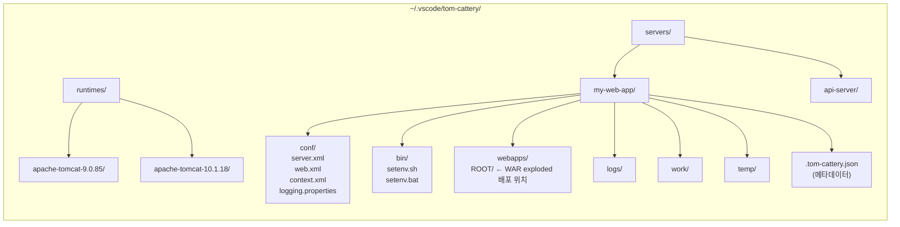
```mermaid
graph LR
    subgraph "~/.vscode/tom-cattery/"
        direction TB
        A["runtimes/"] --> A1["apache-tomcat-9.0.85/"]
        A --> A2["apache-tomcat-10.1.18/"]
        
        B["servers/"] --> B1["my-web-app/"]
        B --> B2["api-server/"]
        
        B1 --> C1["conf/<br/>server.xml<br/>web.xml<br/>context.xml<br/>logging.properties"]
        B1 --> C2["bin/<br/>setenv.sh<br/>setenv.bat"]
        B1 --> C3["webapps/<br/>ROOT/ ← WAR exploded 배포 위치"]
        B1 --> C4["logs/"]
        B1 --> C5["work/"]
        B1 --> C6["temp/"]
        B1 --> C7[".tom-cattery.json<br/>(메타데이터)"]
    end
```

### `.tom-cattery.json` (인스턴스 메타데이터)

```json
{
  "name": "my-web-app",
  "runtimePath": "~/.vscode/tom-cattery/runtimes/apache-tomcat-9.0.85",
  "httpPort": 8080,
  "httpsPort": 8443,
  "shutdownPort": 8005,
  "ajpPort": 8009,
  "debugPort": 8000,
  "javaHome": "/usr/lib/jvm/java-17-openjdk",
  "jvmArgs": "-Xms256m -Xmx1024m",
  "envVars": {
    "SPRING_PROFILES_ACTIVE": "dev"
  },
  "deployments": [
    {
      "name": "web-app",
      "type": "gradle",
      "buildTask": ":web-app:war",
      "warPath": "${workspaceFolder}/web-app/build/libs/web-app.war",
      "contextPath": "/",
      "autoDeploy": true,
      "watchPaths": [
        "${workspaceFolder}/web-app/src/main/java",
        "${workspaceFolder}/web-app/src/main/resources",
        "${workspaceFolder}/web-app/src/main/webapp"
      ]
    }
  ],
  "debug": {
    "enabled": true,
    "port": 8000,
    "suspend": false,
    "sourcePaths": [
      "${workspaceFolder}/web-app/src/main/java",
      "${workspaceFolder}/common-lib/src/main/java"
    ],
    "autoAttach": true
  },
  "autoPortResolve": true,
  "createdAt": "2025-01-15T10:30:00Z"
}
```

---

## 5. 주요 워크플로우

### 5.1 서버 생성 플로우

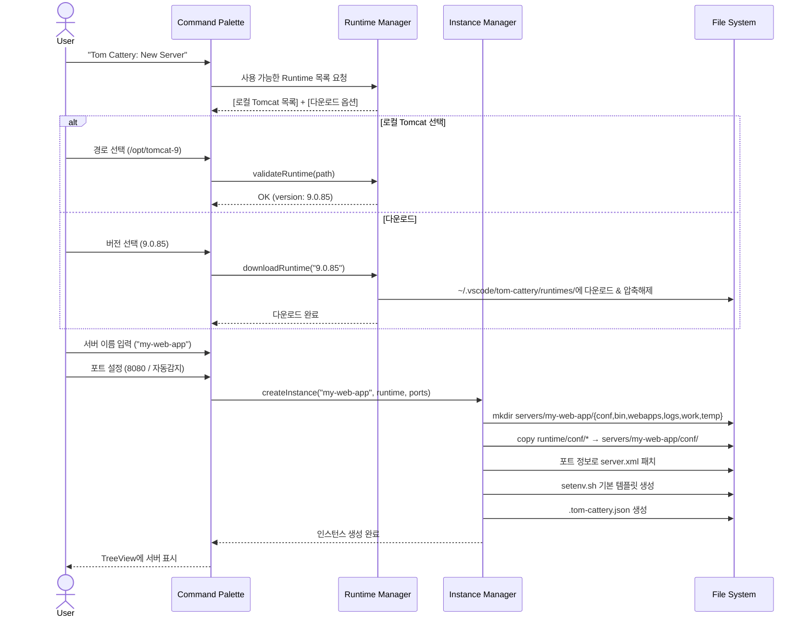
```mermaid
sequenceDiagram
    actor User
    participant CP as Command Palette
    participant RM as Runtime Manager
    participant IM as Instance Manager
    participant FS as File System

    User->>CP: "Tom Cattery: New Server"
    CP->>RM: 사용 가능한 Runtime 목록 요청
    RM-->>CP: [로컬 Tomcat 목록] + [다운로드 옵션]
    
    alt 로컬 Tomcat 선택
        User->>CP: 경로 선택 (/opt/tomcat-9)
        CP->>RM: validateRuntime(path)
        RM-->>CP: OK (version: 9.0.85)
    else 다운로드
        User->>CP: 버전 선택 (9.0.85)
        CP->>RM: downloadRuntime("9.0.85")
        RM->>FS: ~/.vscode/tom-cattery/runtimes/에 다운로드 & 압축해제
        RM-->>CP: 다운로드 완료
    end

    User->>CP: 서버 이름 입력 ("my-web-app")
    User->>CP: 포트 설정 (8080 / 자동감지)
    
    CP->>IM: createInstance("my-web-app", runtime, ports)
    IM->>FS: mkdir servers/my-web-app/{conf,bin,webapps,logs,work,temp}
    IM->>FS: copy runtime/conf/* → servers/my-web-app/conf/
    IM->>FS: 포트 정보로 server.xml 패치
    IM->>FS: setenv.sh 기본 템플릿 생성
    IM->>FS: .tom-cattery.json 생성
    IM-->>CP: 인스턴스 생성 완료
    CP-->>User: TreeView에 서버 표시
```

### 5.2 서버 기동/중지 플로우

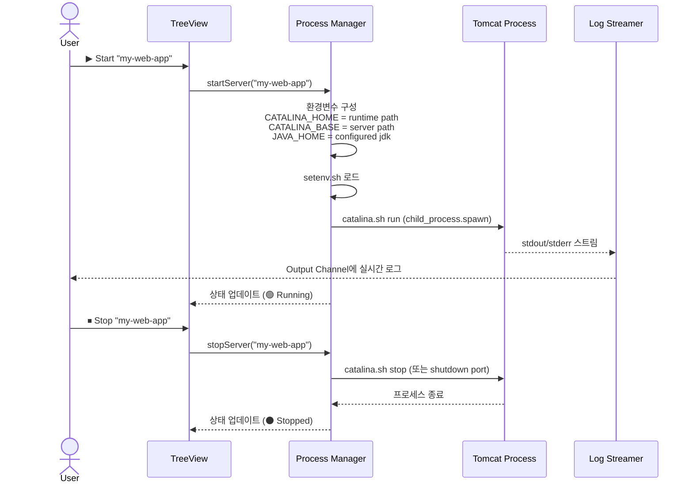
```mermaid
sequenceDiagram
    actor User
    participant TV as TreeView
    participant PM as Process Manager
    participant TC as Tomcat Process
    participant LOG as Log Streamer

    User->>TV: ▶ Start "my-web-app"
    TV->>PM: startServer("my-web-app")
    
    PM->>PM: 환경변수 구성<br/>CATALINA_HOME = runtime path<br/>CATALINA_BASE = server path<br/>JAVA_HOME = configured jdk
    PM->>PM: setenv.sh 로드
    PM->>TC: catalina.sh run (child_process.spawn)
    
    TC-->>LOG: stdout/stderr 스트림
    LOG-->>User: Output Channel에 실시간 로그
    
    PM-->>TV: 상태 업데이트 (🟢 Running)

    User->>TV: ⏹ Stop "my-web-app"
    TV->>PM: stopServer("my-web-app")
    PM->>TC: catalina.sh stop (또는 shutdown port)
    TC-->>PM: 프로세스 종료
    PM-->>TV: 상태 업데이트 (⚫ Stopped)
```

---

## 6. Debug 상세 설계

### 6.1 디버그 아키텍처

Eclipse처럼 "Debug 버튼 하나로 Tomcat 기동 + 디버거 자동 연결"이 핵심 목표.

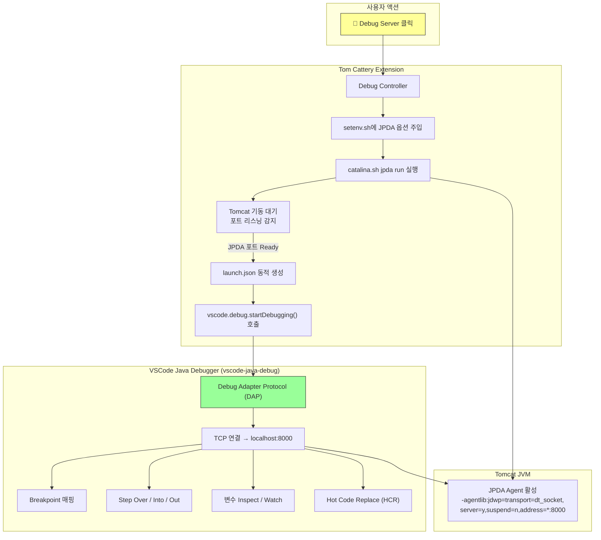
```mermaid
graph TB
    subgraph "사용자 액션"
        A["🐛 Debug Server 클릭"]
    end

    subgraph "Tom Cattery Extension"
        B[Debug Controller]
        B1[setenv.sh에 JPDA 옵션 주입]
        B2["catalina.sh jpda run 실행"]
        B3[Tomcat 기동 대기<br/>포트 리스닝 감지]
        B4[launch.json 동적 생성]
        B5["vscode.debug.startDebugging() 호출"]
    end

    subgraph "Tomcat JVM"
        C["JPDA Agent 활성<br/>-agentlib:jdwp=transport=dt_socket,<br/>server=y,suspend=n,address=*:8000"]
    end

    subgraph "VSCode Java Debugger (vscode-java-debug)"
        D["Debug Adapter Protocol (DAP)"]
        D1["TCP 연결 → localhost:8000"]
        D2["Breakpoint 매핑"]
        D3["Step Over / Into / Out"]
        D4["변수 Inspect / Watch"]
        D5["Hot Code Replace (HCR)"]
    end

    A --> B
    B --> B1 --> B2 --> C
    B2 --> B3
    B3 -->|"JPDA 포트 Ready"| B4
    B4 --> B5 --> D
    D --> D1 --> C
    D1 --> D2
    D1 --> D3
    D1 --> D4
    D1 --> D5

    style A fill:#ff9,stroke:#333
    style D fill:#9f9,stroke:#333
```

### 6.2 Debug 실행 플로우 (원클릭)

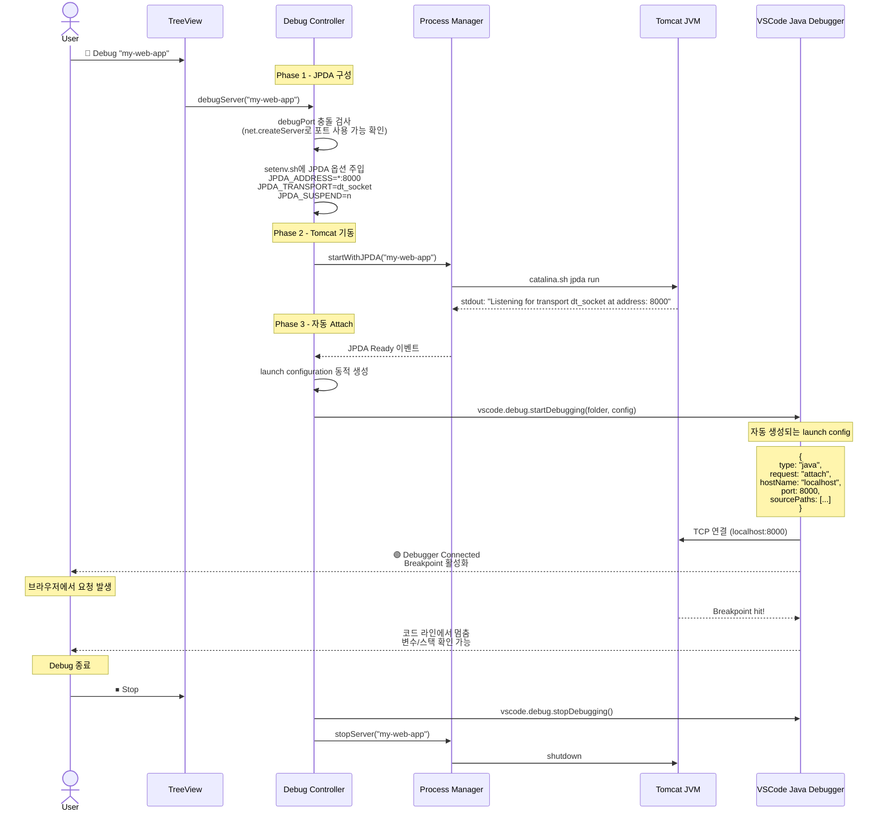
```mermaid
sequenceDiagram
    actor User
    participant TV as TreeView
    participant DC as Debug Controller
    participant PM as Process Manager
    participant TC as Tomcat JVM
    participant DAP as VSCode Java Debugger

    User->>TV: 🐛 Debug "my-web-app"
    
    Note over DC: Phase 1 - JPDA 구성
    TV->>DC: debugServer("my-web-app")
    DC->>DC: debugPort 충돌 검사<br/>(net.createServer로 포트 사용 가능 확인)
    DC->>DC: setenv.sh에 JPDA 옵션 주입<br/>JPDA_ADDRESS=*:8000<br/>JPDA_TRANSPORT=dt_socket<br/>JPDA_SUSPEND=n
    
    Note over DC: Phase 2 - Tomcat 기동
    DC->>PM: startWithJPDA("my-web-app")
    PM->>TC: catalina.sh jpda run
    TC-->>PM: stdout: "Listening for transport dt_socket at address: 8000"
    
    Note over DC: Phase 3 - 자동 Attach
    PM-->>DC: JPDA Ready 이벤트
    DC->>DC: launch configuration 동적 생성
    DC->>DAP: vscode.debug.startDebugging(folder, config)
    
    Note over DAP: 자동 생성되는 launch config
    Note over DAP: {<br/>  type: "java",<br/>  request: "attach",<br/>  hostName: "localhost",<br/>  port: 8000,<br/>  sourcePaths: [...]<br/>}
    
    DAP->>TC: TCP 연결 (localhost:8000)
    DAP-->>User: 🟢 Debugger Connected<br/>Breakpoint 활성화

    Note over User: 브라우저에서 요청 발생
    TC-->>DAP: Breakpoint hit!
    DAP-->>User: 코드 라인에서 멈춤<br/>변수/스택 확인 가능
    
    Note over User: Debug 종료
    User->>TV: ⏹ Stop
    DC->>DAP: vscode.debug.stopDebugging()
    DC->>PM: stopServer("my-web-app")
    PM->>TC: shutdown
```

### 6.3 Debug Controller 핵심 구현

```typescript
import * as vscode from 'vscode';
import * as net from 'net';

export class DebugController {
  
  /**
   * 원클릭 디버그: Tomcat 기동 → JPDA 대기 → 디버거 자동 Attach
   */
  async debugServer(instance: TomcatInstance): Promise<void> {
    const debugPort = instance.debug.port || 8000;
    
    // 1. 포트 사용 가능 여부 확인
    await this.ensurePortAvailable(debugPort);
    
    // 2. setenv.sh에 JPDA 옵션 주입
    await this.injectJpdaConfig(instance, debugPort);
    
    // 3. catalina.sh jpda run 으로 기동
    const process = await this.processManager.start(instance, 'jpda');
    
    // 4. JPDA 포트가 열릴 때까지 대기 (최대 30초)
    await this.waitForJpdaReady(debugPort, 30000);
    
    // 5. VSCode 디버거 자동 attach
    await this.attachDebugger(instance, debugPort);
  }

  /**
   * JPDA 포트 리스닝 감지 - 실제 연결 가능할 때까지 폴링
   */
  private waitForJpdaReady(port: number, timeout: number): Promise<void> {
    return new Promise((resolve, reject) => {
      const startTime = Date.now();
      
      const tryConnect = () => {
        const socket = new net.Socket();
        socket.setTimeout(1000);
        
        socket.on('connect', () => {
          socket.destroy();
          resolve();
        });
        
        socket.on('error', () => {
          socket.destroy();
          if (Date.now() - startTime > timeout) {
            reject(new Error(`JPDA port ${port} not ready within ${timeout}ms`));
          } else {
            setTimeout(tryConnect, 500); // 500ms 간격으로 재시도
          }
        });
        
        socket.connect(port, 'localhost');
      };
      
      tryConnect();
    });
  }

  /**
   * VSCode Java Debugger에 attach - launch.json 없이 동적 실행
   */
  private async attachDebugger(
    instance: TomcatInstance, 
    debugPort: number
  ): Promise<void> {
    
    // source path 결정: 배포 설정의 watchPaths + debug.sourcePaths 통합
    const sourcePaths = this.resolveSourcePaths(instance);
    
    const debugConfig: vscode.DebugConfiguration = {
      type: 'java',
      name: `Tom Cattery: ${instance.name}`,
      request: 'attach',
      hostName: 'localhost',
      port: debugPort,
      // 소스 경로 매핑 - 정확한 breakpoint 매칭의 핵심
      sourcePaths: sourcePaths,
      // 프로젝트 이름 (multi-module에서 중요)
      projectName: instance.deployments[0]?.name || instance.name,
      // 타임아웃 (Tomcat 완전 기동 전 연결 시도 대비)
      timeout: 30000,
    };

    // launch.json에 저장하지 않고 즉시 실행
    const started = await vscode.debug.startDebugging(
      vscode.workspace.workspaceFolders?.[0],
      debugConfig
    );

    if (!started) {
      throw new Error('Failed to start debug session');
    }

    // 디버그 세션 종료 시 자동 정리
    const disposable = vscode.debug.onDidTerminateDebugSession((session) => {
      if (session.name === debugConfig.name) {
        this.onDebugSessionEnd(instance);
        disposable.dispose();
      }
    });

    vscode.window.showInformationMessage(
      `🐛 Debugger attached to ${instance.name} (port ${debugPort})`
    );
  }

  /**
   * setenv.sh에 JPDA 환경변수 주입
   */
  private async injectJpdaConfig(
    instance: TomcatInstance, 
    debugPort: number
  ): Promise<void> {
    const setenvPath = path.join(instance.basePath, 'bin', 'setenv.sh');
    
    // JPDA 블록을 관리영역 마커로 감싸서 재생성 시 교체 가능하게 함
    const jpdaBlock = [
      '# ===== TOM CATTERY DEBUG CONFIG (auto-managed) =====',
      `export JPDA_ADDRESS="*:${debugPort}"`,
      'export JPDA_TRANSPORT="dt_socket"',
      `export JPDA_SUSPEND="${instance.debug.suspend ? 'y' : 'n'}"`,
      '# ===== END TOM CATTERY DEBUG CONFIG =====',
    ].join('\n');

    let content = await fs.readFile(setenvPath, 'utf-8');
    
    // 기존 JPDA 블록이 있으면 교체, 없으면 추가
    const markerRegex = /# ===== TOM CATTERY DEBUG CONFIG.*?# ===== END TOM CATTERY DEBUG CONFIG =====/s;
    if (markerRegex.test(content)) {
      content = content.replace(markerRegex, jpdaBlock);
    } else {
      content += '\n\n' + jpdaBlock + '\n';
    }
    
    await fs.writeFile(setenvPath, content, 'utf-8');
  }

  /**
   * Multi-module 프로젝트의 소스 경로 통합 해석
   */
  private resolveSourcePaths(instance: TomcatInstance): string[] {
    const paths = new Set<string>();
    
    // deployment에 지정된 watchPaths
    for (const dep of instance.deployments) {
      for (const wp of dep.watchPaths || []) {
        paths.add(this.resolveVariables(wp));
      }
    }
    
    // debug 설정에 명시된 sourcePaths
    for (const sp of instance.debug.sourcePaths || []) {
      paths.add(this.resolveVariables(sp));
    }
    
    return Array.from(paths);
  }
}
```

### 6.4 Debug 모드 UX 흐름

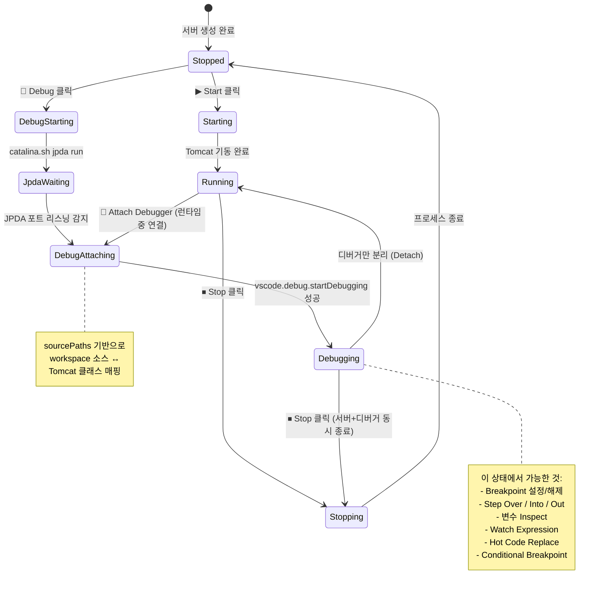
```mermaid
stateDiagram-v2
    [*] --> Stopped: 서버 생성 완료
    
    Stopped --> Starting: ▶ Start 클릭
    Stopped --> DebugStarting: 🐛 Debug 클릭
    
    Starting --> Running: Tomcat 기동 완료
    Running --> Stopping: ⏹ Stop 클릭
    Stopping --> Stopped: 프로세스 종료
    
    DebugStarting --> JpdaWaiting: catalina.sh jpda run
    JpdaWaiting --> DebugAttaching: JPDA 포트 리스닝 감지
    DebugAttaching --> Debugging: vscode.debug.startDebugging 성공
    
    Debugging --> Running: 디버거만 분리 (Detach)
    Debugging --> Stopping: ⏹ Stop 클릭 (서버+디버거 동시 종료)
    
    Running --> DebugAttaching: 🐛 Attach Debugger (런타임 중 연결)
    
    note right of Debugging
        이 상태에서 가능한 것:
        - Breakpoint 설정/해제
        - Step Over / Into / Out
        - 변수 Inspect
        - Watch Expression
        - Hot Code Replace
        - Conditional Breakpoint
    end note
    
    note right of DebugAttaching
        sourcePaths 기반으로
        workspace 소스 ↔ 
        Tomcat 클래스 매핑
    end note
```

### 6.5 Source Path 매핑 전략 (Multi-Module 핵심)

Gradle multi-project에서 디버깅이 자연스럽게 동작하려면 **소스 경로 매핑**이 정확해야 한다.

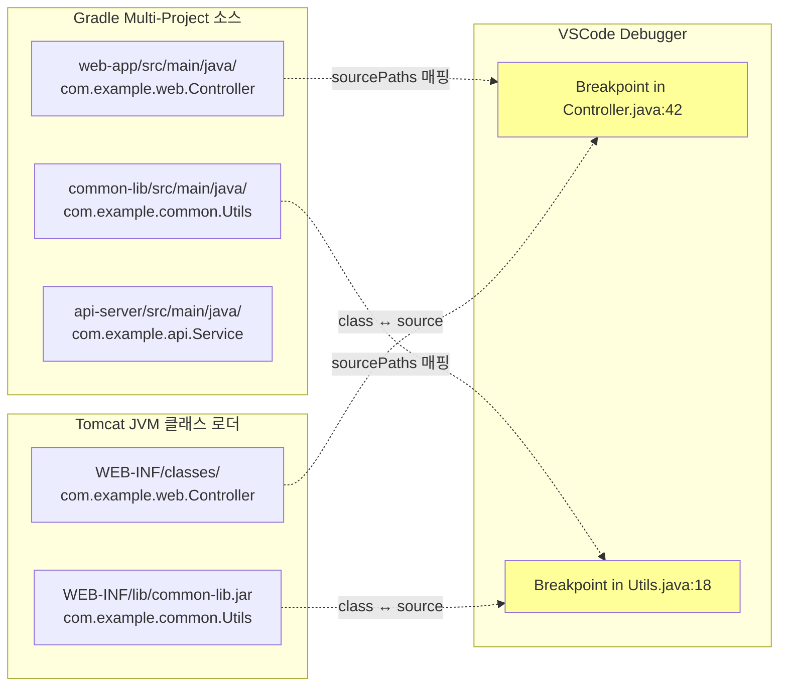
```mermaid
graph LR
    subgraph "Gradle Multi-Project 소스"
        S1["web-app/src/main/java/<br/>com.example.web.Controller"]
        S2["common-lib/src/main/java/<br/>com.example.common.Utils"]
        S3["api-server/src/main/java/<br/>com.example.api.Service"]
    end
    
    subgraph "Tomcat JVM 클래스 로더"
        C1["WEB-INF/classes/<br/>com.example.web.Controller"]
        C2["WEB-INF/lib/common-lib.jar<br/>com.example.common.Utils"]
    end
    
    subgraph "VSCode Debugger"
        D1["Breakpoint in Controller.java:42"]
        D2["Breakpoint in Utils.java:18"]
    end

    S1 -.->|"sourcePaths 매핑"| D1
    S2 -.->|"sourcePaths 매핑"| D2
    C1 -.->|"class ↔ source"| D1
    C2 -.->|"class ↔ source"| D2

    style D1 fill:#ff9
    style D2 fill:#ff9
```

**sourcePaths 자동 감지 전략:**

```typescript
/**
 * workspace 내 Gradle 프로젝트 구조를 분석하여
 * 소스 경로를 자동 감지한다.
 */
async function autoDetectSourcePaths(
  workspaceRoot: string,
  deployment: Deployment
): Promise<string[]> {
  const sourcePaths: string[] = [];
  
  // 1. 배포 대상 모듈의 소스 경로
  const moduleRoot = path.dirname(deployment.warPath).replace('/build/libs', '');
  sourcePaths.push(path.join(moduleRoot, 'src/main/java'));
  sourcePaths.push(path.join(moduleRoot, 'src/main/resources'));
  
  // 2. settings.gradle에서 의존 모듈 탐색
  const settingsGradle = await fs.readFile(
    path.join(workspaceRoot, 'settings.gradle'), 'utf-8'
  );
  const subprojects = parseIncludedProjects(settingsGradle);
  
  // 3. build.gradle에서 project dependency 분석
  const buildGradle = await fs.readFile(
    path.join(moduleRoot, 'build.gradle'), 'utf-8'
  );
  const projectDeps = extractProjectDependencies(buildGradle);
  // 예: implementation project(':common-lib') → common-lib
  
  for (const dep of projectDeps) {
    const depModule = subprojects.find(p => p.name === dep);
    if (depModule) {
      sourcePaths.push(path.join(workspaceRoot, depModule.path, 'src/main/java'));
    }
  }
  
  return sourcePaths.filter(p => fs.existsSync(p));
}
```

### 6.6 Hot Code Replace (HCR) 지원

디버그 중 소스 수정 → 저장 시 JVM에 바로 반영:

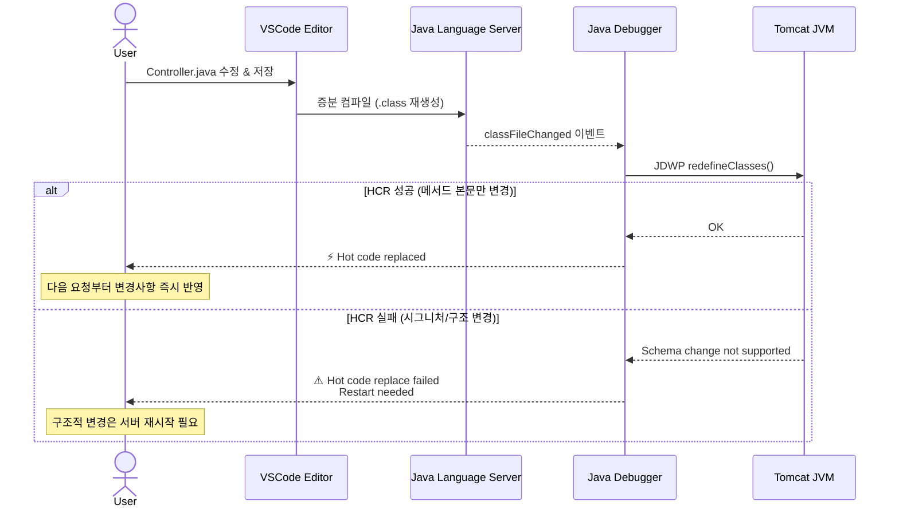
```mermaid
sequenceDiagram
    actor User
    participant Editor as VSCode Editor
    participant JDT as Java Language Server
    participant DAP as Java Debugger
    participant TC as Tomcat JVM

    User->>Editor: Controller.java 수정 & 저장
    Editor->>JDT: 증분 컴파일 (.class 재생성)
    JDT-->>DAP: classFileChanged 이벤트
    DAP->>TC: JDWP redefineClasses()
    
    alt HCR 성공 (메서드 본문만 변경)
        TC-->>DAP: OK
        DAP-->>User: ⚡ Hot code replaced
        Note over User: 다음 요청부터 변경사항 즉시 반영
    else HCR 실패 (시그니처/구조 변경)
        TC-->>DAP: Schema change not supported
        DAP-->>User: ⚠️ Hot code replace failed<br/>Restart needed
        Note over User: 구조적 변경은 서버 재시작 필요
    end
```

---

## 7. WAR Exploded 자동 배포 상세 설계

### 7.1 배포 아키텍처

WAR 파일을 webapps 하위에 **exploded(압축 해제) 형태**로 배포하여,  
Tomcat의 auto-reload와 개발 중 빠른 갱신이 가능하도록 한다.

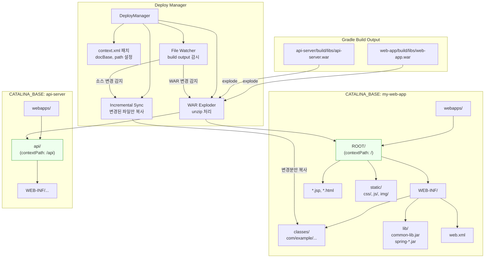
```mermaid
graph TB
    subgraph "Gradle Build Output"
        W1["web-app/build/libs/web-app.war"]
        W2["api-server/build/libs/api-server.war"]
    end

    subgraph "Deploy Manager"
        DM[DeployManager]
        EX[WAR Exploder<br/>unzip 처리]
        CX[context.xml 패치<br/>docBase, path 설정]
        FW[File Watcher<br/>build output 감시]
        SYNC[Incremental Sync<br/>변경된 파일만 복사]
    end

    subgraph "CATALINA_BASE: my-web-app"
        direction TB
        WA["webapps/"]
        WA --> ROOT["ROOT/<br/>(contextPath: /)"]
        ROOT --> ROOT_WEB["WEB-INF/"]
        ROOT_WEB --> ROOT_CLS["classes/<br/>com/example/..."]
        ROOT_WEB --> ROOT_LIB["lib/<br/>common-lib.jar<br/>spring-*.jar"]
        ROOT_WEB --> ROOT_XML["web.xml"]
        ROOT --> ROOT_JSP["*.jsp, *.html"]
        ROOT --> ROOT_STATIC["static/<br/>css/, js/, img/"]
    end

    subgraph "CATALINA_BASE: api-server"
        WA2["webapps/"]
        WA2 --> API["api/<br/>(contextPath: /api)"]
        API --> API_WEB["WEB-INF/..."]
    end

    W1 -->|"explode"| EX
    W2 -->|"explode"| EX
    EX --> ROOT
    EX --> API
    DM --> EX
    DM --> CX
    DM --> FW
    DM --> SYNC
    FW -->|"WAR 변경 감지"| EX
    FW -->|"소스 변경 감지"| SYNC
    SYNC -->|"변경분만 복사"| ROOT_CLS

    style ROOT fill:#efe,stroke:#393
    style API fill:#efe,stroke:#393
```

### 7.2 배포 플로우

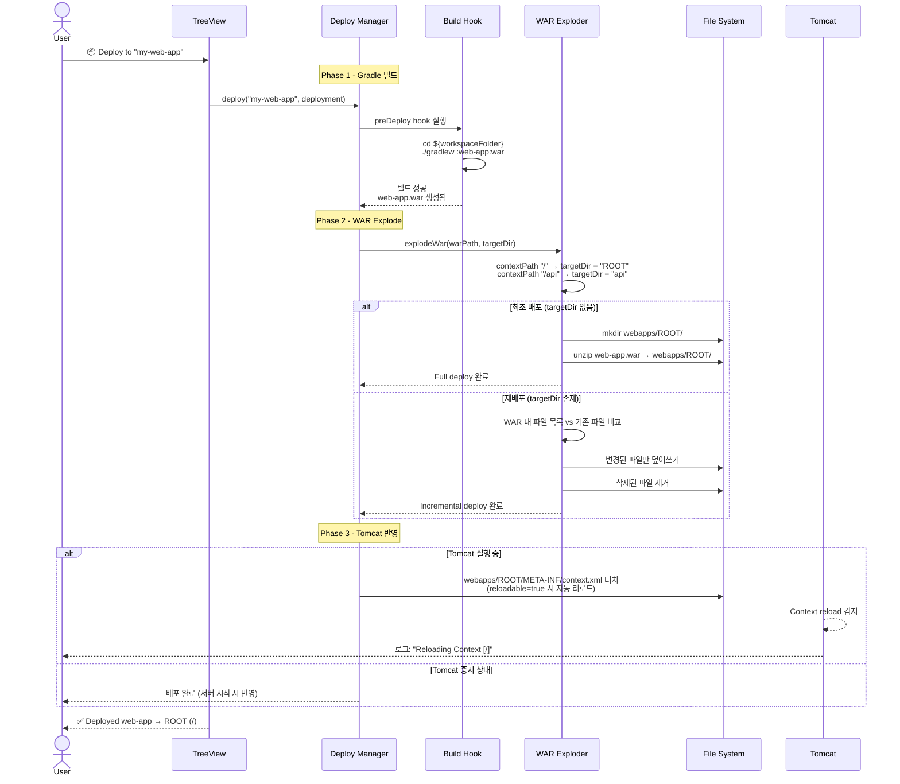
```mermaid
sequenceDiagram
    actor User
    participant TV as TreeView
    participant DM as Deploy Manager
    participant BH as Build Hook
    participant EX as WAR Exploder
    participant FS as File System
    participant TC as Tomcat

    User->>TV: 📦 Deploy to "my-web-app"
    
    Note over DM: Phase 1 - Gradle 빌드
    TV->>DM: deploy("my-web-app", deployment)
    DM->>BH: preDeploy hook 실행
    BH->>BH: cd ${workspaceFolder}<br/>./gradlew :web-app:war
    BH-->>DM: 빌드 성공<br/>web-app.war 생성됨
    
    Note over DM: Phase 2 - WAR Explode
    DM->>EX: explodeWar(warPath, targetDir)
    EX->>EX: contextPath "/" → targetDir = "ROOT"<br/>contextPath "/api" → targetDir = "api"
    
    alt 최초 배포 (targetDir 없음)
        EX->>FS: mkdir webapps/ROOT/
        EX->>FS: unzip web-app.war → webapps/ROOT/
        EX-->>DM: Full deploy 완료
    else 재배포 (targetDir 존재)
        EX->>EX: WAR 내 파일 목록 vs 기존 파일 비교
        EX->>FS: 변경된 파일만 덮어쓰기
        EX->>FS: 삭제된 파일 제거
        EX-->>DM: Incremental deploy 완료
    end
    
    Note over DM: Phase 3 - Tomcat 반영
    alt Tomcat 실행 중
        DM->>FS: webapps/ROOT/META-INF/context.xml 터치<br/>(reloadable=true 시 자동 리로드)
        TC-->>TC: Context reload 감지
        TC-->>User: 로그: "Reloading Context [/]"
    else Tomcat 중지 상태
        DM-->>User: 배포 완료 (서버 시작 시 반영)
    end
    
    TV-->>User: ✅ Deployed web-app → ROOT (/)
```

### 7.3 Context Path ↔ webapps 디렉토리 매핑 규칙

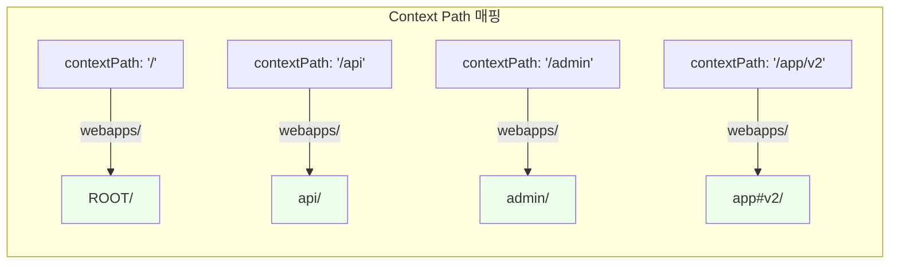
```mermaid
graph LR
    subgraph "Context Path 매핑"
        CP1["contextPath: '/'"] -->|"webapps/"| D1["ROOT/"]
        CP2["contextPath: '/api'"] -->|"webapps/"| D2["api/"]
        CP3["contextPath: '/admin'"] -->|"webapps/"| D3["admin/"]
        CP4["contextPath: '/app/v2'"] -->|"webapps/"| D4["app#v2/"]
    end

    style D1 fill:#efe
    style D2 fill:#efe
    style D3 fill:#efe
    style D4 fill:#efe
```

> Tomcat 규칙: `/` → `ROOT`, `/path` → `path`, `/nested/path` → `nested#path`

### 7.4 Deploy Manager 핵심 구현

```typescript
import * as vscode from 'vscode';
import * as path from 'path';
import * as fs from 'fs/promises';
import AdmZip from 'adm-zip';

export class DeployManager {
  private fileWatchers: Map<string, vscode.FileSystemWatcher> = new Map();

  /**
   * WAR를 exploded 형태로 webapps에 배포
   */
  async deploy(instance: TomcatInstance, deployment: Deployment): Promise<void> {
    // 1. preDeploy 빌드 훅 실행
    if (deployment.buildTask) {
      await this.runBuildHook(instance, deployment);
    }

    // 2. WAR 파일 존재 확인
    const warPath = this.resolveVariables(deployment.warPath);
    if (!await this.fileExists(warPath)) {
      throw new Error(`WAR file not found: ${warPath}`);
    }

    // 3. contextPath → webapps 디렉토리명 변환
    const webappDir = this.contextPathToDir(deployment.contextPath);
    const targetPath = path.join(instance.basePath, 'webapps', webappDir);

    // 4. Exploded 배포 수행
    await this.explodeWar(warPath, targetPath);

    // 5. 서버 실행 중이면 context reload 트리거
    if (instance.status === 'running' || instance.status === 'debugging') {
      await this.triggerReload(instance, deployment.contextPath);
    }

    vscode.window.showInformationMessage(
      `🐱 Deployed ${deployment.name} → ${webappDir} (${deployment.contextPath})`
    );
  }

  /**
   * WAR explode: 최초이면 전체 해제, 이후에는 증분 업데이트
   */
  private async explodeWar(warPath: string, targetPath: string): Promise<void> {
    const zip = new AdmZip(warPath);
    const entries = zip.getEntries();

    if (!await this.fileExists(targetPath)) {
      // === 최초 배포: 전체 압축 해제 ===
      await fs.mkdir(targetPath, { recursive: true });
      zip.extractAllTo(targetPath, true);
      return;
    }

    // === 증분 배포: 변경된 파일만 갱신 ===
    const existingFiles = await this.listFilesRecursive(targetPath);
    const warFiles = new Set<string>();

    for (const entry of entries) {
      if (entry.isDirectory) continue;
      
      warFiles.add(entry.entryName);
      const filePath = path.join(targetPath, entry.entryName);
      
      // 파일이 없거나 크기/CRC가 다르면 덮어쓰기
      const needsUpdate = await this.needsUpdate(filePath, entry);
      if (needsUpdate) {
        await fs.mkdir(path.dirname(filePath), { recursive: true });
        await fs.writeFile(filePath, entry.getData());
      }
    }

    // WAR에서 삭제된 파일 제거
    for (const existing of existingFiles) {
      const relativePath = path.relative(targetPath, existing);
      if (!warFiles.has(relativePath)) {
        await fs.unlink(existing);
      }
    }
  }

  /**
   * contextPath를 Tomcat webapps 디렉토리명으로 변환
   */
  private contextPathToDir(contextPath: string): string {
    if (contextPath === '/' || contextPath === '') return 'ROOT';
    // /api → api, /app/v2 → app#v2
    return contextPath.replace(/^\//, '').replace(/\//g, '#');
  }

  /**
   * Gradle 빌드 태스크 실행
   */
  private async runBuildHook(
    instance: TomcatInstance, 
    deployment: Deployment
  ): Promise<void> {
    const workspaceRoot = vscode.workspace.workspaceFolders?.[0]?.uri.fsPath;
    if (!workspaceRoot) throw new Error('No workspace folder');

    return new Promise((resolve, reject) => {
      const gradlew = process.platform === 'win32' ? 'gradlew.bat' : './gradlew';
      
      const task = new vscode.Task(
        { type: 'gradle', task: deployment.buildTask },
        vscode.TaskScope.Workspace,
        `Build ${deployment.name}`,
        'Tom Cattery',
        new vscode.ShellExecution(`${gradlew} ${deployment.buildTask}`, {
          cwd: workspaceRoot,
        })
      );

      vscode.tasks.executeTask(task).then(execution => {
        const disposable = vscode.tasks.onDidEndTaskProcess(e => {
          if (e.execution === execution) {
            disposable.dispose();
            if (e.exitCode === 0) resolve();
            else reject(new Error(`Build failed with exit code ${e.exitCode}`));
          }
        });
      });
    });
  }

  /**
   * 파일 변경 감시 → 자동 재배포 (autoDeploy: true)
   */
  setupAutoDeployWatcher(instance: TomcatInstance, deployment: Deployment): void {
    if (!deployment.autoDeploy || !deployment.watchPaths) return;

    const watchKey = `${instance.name}:${deployment.name}`;
    
    // 기존 watcher 정리
    this.fileWatchers.get(watchKey)?.dispose();

    // debounce를 위한 타이머
    let debounceTimer: NodeJS.Timeout;

    for (const watchPath of deployment.watchPaths) {
      const resolved = this.resolveVariables(watchPath);
      const pattern = new vscode.RelativePattern(resolved, '**/*');
      const watcher = vscode.workspace.createFileSystemWatcher(pattern);

      const onFileChange = (uri: vscode.Uri) => {
        clearTimeout(debounceTimer);
        debounceTimer = setTimeout(async () => {
          const fileName = path.basename(uri.fsPath);
          
          // .class 파일 변경 → HCR로 처리되므로 스킵
          if (fileName.endsWith('.class')) return;
          
          // JSP, HTML, CSS, JS, properties 등 → 즉시 동기화
          if (this.isHotDeployable(fileName)) {
            await this.syncSingleFile(instance, deployment, uri.fsPath);
          } else {
            // Java 소스 변경 → 빌드 & 재배포
            await this.deploy(instance, deployment);
          }
        }, 1000); // 1초 debounce
      };

      watcher.onDidChange(onFileChange);
      watcher.onDidCreate(onFileChange);
      watcher.onDidDelete(onFileChange);

      this.fileWatchers.set(watchKey, watcher);
    }
  }

  /**
   * JSP/HTML/CSS 등 정적 파일은 빌드 없이 직접 복사 (즉시 반영)
   */
  private async syncSingleFile(
    instance: TomcatInstance,
    deployment: Deployment,
    changedFilePath: string
  ): Promise<void> {
    const webappSrc = this.findWebappSourceRoot(deployment, changedFilePath);
    if (!webappSrc) return;

    const relativePath = path.relative(webappSrc, changedFilePath);
    const webappDir = this.contextPathToDir(deployment.contextPath);
    const targetFile = path.join(instance.basePath, 'webapps', webappDir, relativePath);

    await fs.mkdir(path.dirname(targetFile), { recursive: true });
    await fs.copyFile(changedFilePath, targetFile);
    
    vscode.window.setStatusBarMessage(
      `🐱 Hot-synced: ${relativePath}`, 3000
    );
  }

  /**
   * 빌드 없이 즉시 복사 가능한 파일 유형 판별
   */
  private isHotDeployable(fileName: string): boolean {
    const ext = path.extname(fileName).toLowerCase();
    return [
      '.jsp', '.jspf', '.html', '.htm',
      '.css', '.js', '.ts',
      '.json', '.xml', '.properties', '.yaml', '.yml',
      '.png', '.jpg', '.gif', '.svg', '.ico',
    ].includes(ext);
  }

  /**
   * Context reload 트리거
   */
  private async triggerReload(
    instance: TomcatInstance, 
    contextPath: string
  ): Promise<void> {
    const webappDir = this.contextPathToDir(contextPath);
    const contextXml = path.join(
      instance.basePath, 'webapps', webappDir, 'META-INF', 'context.xml'
    );
    
    if (await this.fileExists(contextXml)) {
      const now = new Date();
      await fs.utimes(contextXml, now, now);
    }
  }
}
```

### 7.5 자동 배포 파일 변경 감지 전략

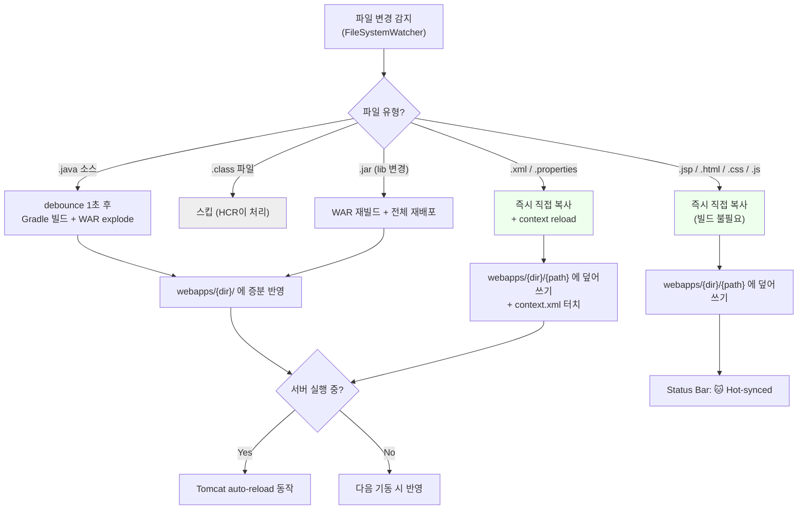
```mermaid
flowchart TD
    A["파일 변경 감지<br/>(FileSystemWatcher)"] --> B{파일 유형?}
    
    B -->|".java 소스"| C["debounce 1초 후<br/>Gradle 빌드 + WAR explode"]
    B -->|".class 파일"| D["스킵 (HCR이 처리)"]
    B -->|".jsp / .html / .css / .js"| E["즉시 직접 복사<br/>(빌드 불필요)"]
    B -->|".xml / .properties"| F["즉시 직접 복사<br/>+ context reload"]
    B -->|".jar (lib 변경)"| G["WAR 재빌드 + 전체 재배포"]
    
    C --> H["webapps/{dir}/ 에 증분 반영"]
    E --> I["webapps/{dir}/{path} 에 덮어쓰기"]
    F --> J["webapps/{dir}/{path} 에 덮어쓰기<br/>+ context.xml 터치"]
    G --> H
    
    H --> K{서버 실행 중?}
    I --> L["Status Bar: 🐱 Hot-synced"]
    J --> K
    
    K -->|Yes| M["Tomcat auto-reload 동작"]
    K -->|No| N["다음 기동 시 반영"]

    style E fill:#efe
    style F fill:#efe
    style D fill:#eee
```

### 7.6 Gradle Multi-Project 통합 배포 시나리오

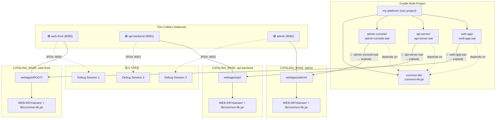
```mermaid
graph TB
    subgraph "Gradle Multi-Project"
        ROOT["my-platform/ (root project)"]
        ROOT --> WEB["web-app/<br/>:web-app:war"]
        ROOT --> API["api-server/<br/>:api-server:war"]
        ROOT --> ADMIN["admin-console/<br/>:admin-console:war"]
        ROOT --> COMMON["common-lib/<br/>:common-lib:jar"]
        
        WEB -.->|"depends on"| COMMON
        API -.->|"depends on"| COMMON
        ADMIN -.->|"depends on"| COMMON
    end

    subgraph "Tom Cattery Instances"
        S1["🟢 web-front (8080)"]
        S2["🟢 api-backend (8081)"]
        S3["🟢 admin (8082)"]
    end

    subgraph "CATALINA_BASE: web-front"
        WA1["webapps/ROOT/"] --> WEB_INF1["WEB-INF/classes/ + lib/common-lib.jar"]
    end

    subgraph "CATALINA_BASE: api-backend"
        WA2["webapps/api/"] --> WEB_INF2["WEB-INF/classes/ + lib/common-lib.jar"]
    end

    subgraph "CATALINA_BASE: admin"
        WA3["webapps/admin/"] --> WEB_INF3["WEB-INF/classes/ + lib/common-lib.jar"]
    end

    WEB -->|"🔨 :web-app:war<br/>→ explode"| WA1
    API -->|"🔨 :api-server:war<br/>→ explode"| WA2
    ADMIN -->|"🔨 :admin-console:war<br/>→ explode"| WA3

    S1 --- WA1
    S2 --- WA2
    S3 --- WA3

    subgraph "동시 디버깅"
        S1 -.->|"JPDA :8000"| DBG1["Debug Session 1"]
        S2 -.->|"JPDA :8001"| DBG2["Debug Session 2"]
        S3 -.->|"JPDA :8002"| DBG3["Debug Session 3"]
    end
```

---

## 8. VSCode UI 구성

### 8.1 TreeView (Activity Bar)

```
🐱 TOM CATTERY
├── 📦 Runtimes
│   ├── Apache Tomcat 9.0.85  (/opt/tomcat-9)
│   └── Apache Tomcat 10.1.18 (downloaded)
│       └── [🗑 Remove]
│
├── 🖥 Servers
│   ├── 🟢 my-web-app (8080) 🐛
│   │   ├── 📄 server.xml        [✏️ Edit]
│   │   ├── 📄 setenv.sh         [✏️ Edit]
│   │   ├── 📄 context.xml       [✏️ Edit]
│   │   ├── 📂 webapps
│   │   │   └── ROOT/ (web-app → /)   [🔄 Redeploy]
│   │   ├── 📂 logs              [📖 Open]
│   │   └── ⚙️ Settings          [✏️ Edit]
│   │       └── [▶ Start] [⏹ Stop] [🔄 Restart] [🐛 Debug]
│   │
│   ├── 🟢 api-server (8081)
│   │   ├── 📂 webapps
│   │   │   └── api/ (api-server → /api)
│   │   └── ...
│   │
│   └── ⚫ admin (8082)
│       └── ...
│
└── ➕ Add Server
```

### 8.2 설정 Webview (Server Config Form)

```
┌─────────────────────────────────────────────────┐
│  🐱 Server Configuration: my-web-app            │
├─────────────────────────────────────────────────┤
│                                                 │
│  General                                        │
│  ┌─────────────────────────────────────────┐    │
│  │ Server Name:  [my-web-app            ]  │    │
│  │ Runtime:      [Apache Tomcat 9.0.85  ▼] │    │
│  │ JAVA_HOME:    [/usr/lib/jvm/jdk-17   ]  │    │
│  └─────────────────────────────────────────┘    │
│                                                 │
│  Ports                                          │
│  ┌─────────────────────────────────────────┐    │
│  │ HTTP:      [8080]  HTTPS:    [8443]     │    │
│  │ Shutdown:  [8005]  AJP:      [8009]     │    │
│  │ Debug:     [8000]                       │    │
│  │ ☑ Auto-resolve port conflicts           │    │
│  └─────────────────────────────────────────┘    │
│                                                 │
│  JVM Options                                    │
│  ┌─────────────────────────────────────────┐    │
│  │ -Xms256m                                │    │
│  │ -Xmx1024m                               │    │
│  │ -Dfile.encoding=UTF-8                   │    │
│  └─────────────────────────────────────────┘    │
│                                                 │
│  Environment Variables                          │
│  ┌──────────────────┬──────────────────────┐    │
│  │ Key              │ Value                │    │
│  │ SPRING_PROFILES  │ dev                  │    │
│  │ DB_HOST          │ localhost            │    │
│  │ [+ Add Variable]                        │    │
│  └──────────────────┴──────────────────────┘    │
│                                                 │
│  Deployments                                    │
│  ┌─────────────────────────────────────────┐    │
│  │ 📦 web-app                              │    │
│  │   WAR:     web-app/build/libs/web-app.war│   │
│  │   Context: /  →  webapps/ROOT/          │    │
│  │   Build:   :web-app:war                 │    │
│  │   ☑ Auto-deploy on change              │    │
│  │   Watch:                                │    │
│  │     ☑ src/main/java                    │    │
│  │     ☑ src/main/resources               │    │
│  │     ☑ src/main/webapp                  │    │
│  │   [🔄 Deploy Now] [🗑 Remove]           │    │
│  │                                         │    │
│  │ [+ Add Deployment]                      │    │
│  └─────────────────────────────────────────┘    │
│                                                 │
│  Debug                                          │
│  ┌─────────────────────────────────────────┐    │
│  │ ☑ Enable Debug Mode                    │    │
│  │ JPDA Port:    [8000]                    │    │
│  │ Suspend on start: ☐                    │    │
│  │ ☑ Auto-attach debugger                 │    │
│  │ Source Paths:                            │    │
│  │   ✓ web-app/src/main/java   (auto)     │    │
│  │   ✓ common-lib/src/main/java (dep)     │    │
│  │   [+ Add Source Path]                   │    │
│  └─────────────────────────────────────────┘    │
│                                                 │
│         [Save]  [Apply & Restart]               │
└─────────────────────────────────────────────────┘
```

---

## 9. 핵심 모듈 설계

### 9.1 모듈 의존 관계

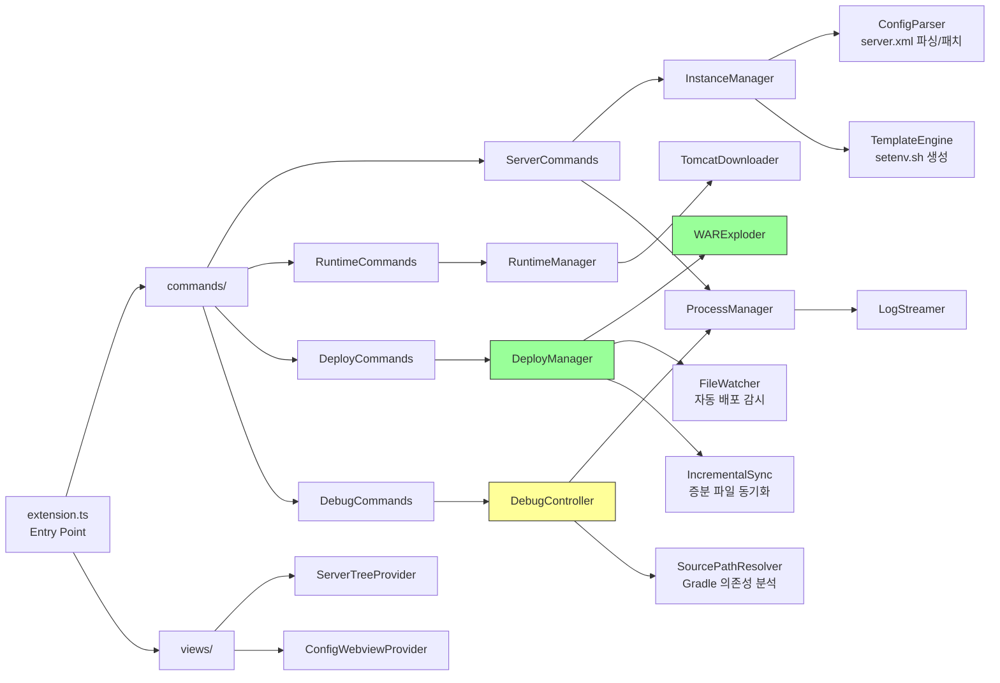
```mermaid
graph LR
    A[extension.ts<br/>Entry Point] --> B[commands/]
    A --> C[views/]
    
    B --> D[ServerCommands]
    B --> E[RuntimeCommands]
    B --> F[DeployCommands]
    B --> G[DebugCommands]
    
    C --> H[ServerTreeProvider]
    C --> I[ConfigWebviewProvider]
    
    D --> J[InstanceManager]
    D --> K[ProcessManager]
    E --> L[RuntimeManager]
    F --> M[DeployManager]
    G --> N[DebugController]
    
    J --> O[ConfigParser<br/>server.xml 파싱/패치]
    J --> P[TemplateEngine<br/>setenv.sh 생성]
    K --> Q[LogStreamer]
    L --> R[TomcatDownloader]
    M --> S[WARExploder]
    M --> T[FileWatcher<br/>자동 배포 감시]
    M --> U[IncrementalSync<br/>증분 파일 동기화]
    N --> K
    N --> V[SourcePathResolver<br/>Gradle 의존성 분석]
    
    style N fill:#ff9,stroke:#333
    style M fill:#9f9,stroke:#333
    style S fill:#9f9,stroke:#333
```

### 9.2 주요 인터페이스

```typescript
// 서버 인스턴스 정의
interface TomcatInstance {
  name: string;
  basePath: string;          // CATALINA_BASE
  runtimePath: string;       // CATALINA_HOME
  ports: PortConfig;
  javaHome: string;
  jvmArgs: string[];
  envVars: Record<string, string>;
  deployments: Deployment[];
  debug: DebugConfig;
  status: 'stopped' | 'starting' | 'running' | 'stopping' | 'debugging';
}

interface PortConfig {
  http: number;
  https: number;
  shutdown: number;
  ajp: number;
  debug: number;             // JPDA 포트
}

interface Deployment {
  name: string;              // 배포 식별자
  type: 'war' | 'exploded' | 'gradle';
  buildTask?: string;        // Gradle task (예: ":web-app:war")
  warPath: string;           // WAR 파일 경로
  contextPath: string;       // 컨텍스트 패스 (예: "/", "/api")
  autoDeploy: boolean;       // 파일 변경 시 자동 재배포
  watchPaths?: string[];     // 변경 감시 대상 경로
}

interface DebugConfig {
  enabled: boolean;
  port: number;              // JPDA 포트
  suspend: boolean;          // 기동 시 디버거 연결까지 대기
  autoAttach: boolean;       // 디버그 모드 시 자동 attach
  sourcePaths: string[];     // 소스 경로 (breakpoint 매핑)
}

// Runtime 정의
interface TomcatRuntime {
  version: string;
  path: string;
  type: 'local' | 'downloaded';
  majorVersion: number;      // 9, 10, 11
}
```

---

## 10. CATALINA_BASE 구성 상세

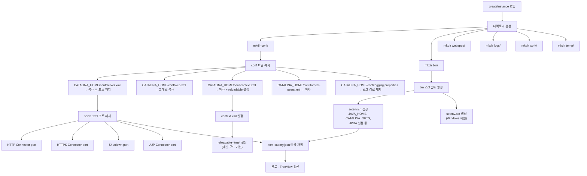
```mermaid
flowchart TD
    A[createInstance 호출] --> B[디렉토리 생성]
    B --> B1["mkdir conf/"]
    B --> B2["mkdir bin/"]
    B --> B3["mkdir webapps/"]
    B --> B4["mkdir logs/"]
    B --> B5["mkdir work/"]
    B --> B6["mkdir temp/"]
    
    B1 --> C[conf 파일 복사]
    C --> C1["CATALINA_HOME/conf/server.xml → 복사 후 포트 패치"]
    C --> C2["CATALINA_HOME/conf/web.xml → 그대로 복사"]
    C --> C3["CATALINA_HOME/conf/context.xml → 복사 + reloadable 설정"]
    C --> C4["CATALINA_HOME/conf/tomcat-users.xml → 복사"]
    C --> C5["CATALINA_HOME/conf/logging.properties → 로그 경로 패치"]
    
    B2 --> D[bin 스크립트 생성]
    D --> D1["setenv.sh 생성<br/>JAVA_HOME, CATALINA_OPTS,<br/>JPDA 설정 등"]
    D --> D2["setenv.bat 생성<br/>(Windows 지원)"]
    
    C1 --> E[server.xml 포트 패치]
    E --> E1["HTTP Connector port"]
    E --> E2["HTTPS Connector port"]
    E --> E3["Shutdown port"]
    E --> E4["AJP Connector port"]
    
    C3 --> F[context.xml 설정]
    F --> F1["reloadable='true' 설정<br/>(개발 모드 기본)"]
    
    D1 --> G[.tom-cattery.json 메타 저장]
    E --> G
    G --> H[완료 - TreeView 갱신]
```

### setenv.sh 템플릿

```bash
#!/bin/bash
# Generated by Tom Cattery - VSCode Extension
# Server: my-web-app

# Java Home
export JAVA_HOME="/usr/lib/jvm/java-17-openjdk"

# JVM Options
CATALINA_OPTS="$CATALINA_OPTS -Xms256m"
CATALINA_OPTS="$CATALINA_OPTS -Xmx1024m"
CATALINA_OPTS="$CATALINA_OPTS -Dfile.encoding=UTF-8"

# Application Properties
CATALINA_OPTS="$CATALINA_OPTS -Dspring.profiles.active=dev"

# Custom Environment Variables
export APP_ENV="development"
export DB_HOST="localhost"

export CATALINA_OPTS

# ===== TOM CATTERY DEBUG CONFIG (auto-managed) =====
export JPDA_ADDRESS="*:8000"
export JPDA_TRANSPORT="dt_socket"
export JPDA_SUSPEND="n"
# ===== END TOM CATTERY DEBUG CONFIG =====
```

---

## 11. 기술 스택 및 구현 계획

### 기술 스택

| 영역 | 기술 |
|------|------|
| Extension 언어 | TypeScript |
| UI Framework | VSCode Webview API + (Svelte 또는 vanilla HTML/CSS) |
| XML 파싱 | `fast-xml-parser` 또는 `xml2js` |
| WAR 처리 | `adm-zip` (unzip) |
| 프로세스 관리 | Node.js `child_process.spawn` |
| 다운로드 | Node.js `https` + `tar`/`adm-zip` |
| 로그 스트리밍 | `fs.watch` + `readline` (tail -f 방식) |
| 디버그 연동 | VSCode Debug API (`vscode.debug.startDebugging`) |
| Gradle 연동 | VSCode Task API |
| 테스트 | Mocha + VSCode Extension Test API |

### 구현 단계

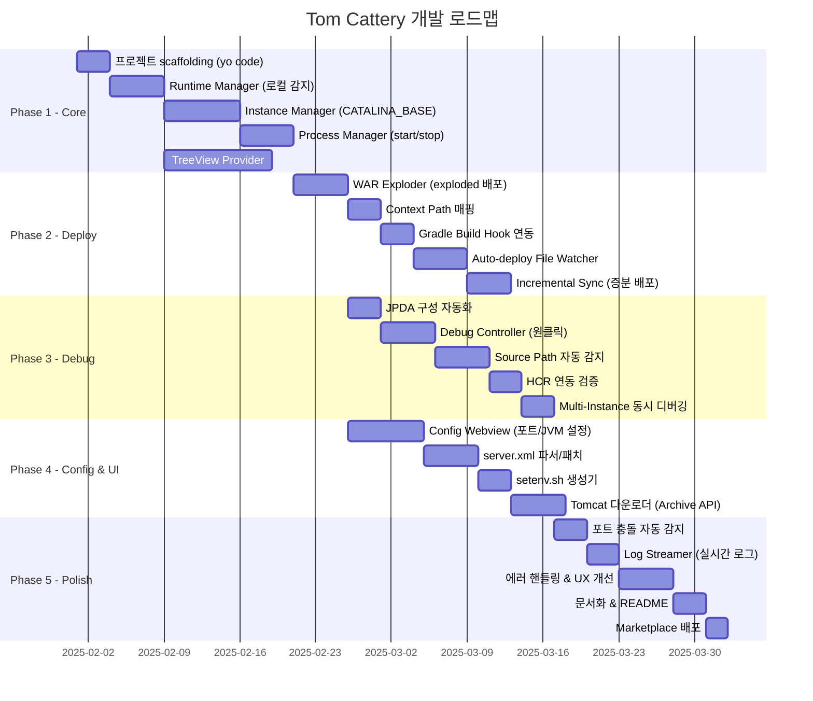
```mermaid
gantt
    title Tom Cattery 개발 로드맵
    dateFormat  YYYY-MM-DD
    
    section Phase 1 - Core
    프로젝트 scaffolding (yo code)    :p1a, 2025-02-01, 3d
    Runtime Manager (로컬 감지)       :p1b, after p1a, 5d
    Instance Manager (CATALINA_BASE)  :p1c, after p1b, 7d
    Process Manager (start/stop)      :p1d, after p1c, 5d
    TreeView Provider                 :p1e, after p1b, 10d
    
    section Phase 2 - Deploy
    WAR Exploder (exploded 배포)      :p2a, after p1d, 5d
    Context Path 매핑                 :p2b, after p2a, 3d
    Gradle Build Hook 연동            :p2c, after p2b, 3d
    Auto-deploy File Watcher          :p2d, after p2c, 5d
    Incremental Sync (증분 배포)      :p2e, after p2d, 4d
    
    section Phase 3 - Debug
    JPDA 구성 자동화                  :p3a, after p2a, 3d
    Debug Controller (원클릭)         :p3b, after p3a, 5d
    Source Path 자동 감지             :p3c, after p3b, 5d
    HCR 연동 검증                     :p3d, after p3c, 3d
    Multi-Instance 동시 디버깅         :p3e, after p3d, 3d
    
    section Phase 4 - Config & UI
    Config Webview (포트/JVM 설정)    :p4a, after p2a, 7d
    server.xml 파서/패치              :p4b, after p4a, 5d
    setenv.sh 생성기                  :p4c, after p4b, 3d
    Tomcat 다운로더 (Archive API)     :p4d, after p4c, 5d
    
    section Phase 5 - Polish
    포트 충돌 자동 감지               :p5a, after p3e, 3d
    Log Streamer (실시간 로그)        :p5b, after p5a, 3d
    에러 핸들링 & UX 개선             :p5c, after p5b, 5d
    문서화 & README                   :p5d, after p5c, 3d
    Marketplace 배포                  :p5e, after p5d, 2d
```

---

## 12. Community Server Connector 대비 차별점

| 항목 | Community Server Connector | Tom Cattery |
|------|---------------------------|-------------|
| 서버 종류 | 범용 (WildFly, Tomcat 등) | **Tomcat 전문** - 깊은 최적화 |
| CATALINA_BASE | 자동 생성되나 커스텀 어려움 | **명시적 구조** + 직접 편집 가능 |
| Multi-Instance | 설정 복잡 | **서버별 독립 관리**, 포트 자동 할당 |
| setenv.sh | 지원 미흡 | **GUI + 직접 편집** 모두 지원 |
| WAR 배포 | WAR 파일 직접 배포 | **Exploded 자동 배포** + 증분 동기화 |
| 자동 배포 | 없음 | **File Watcher** + Hot Sync (JSP/HTML 즉시 반영) |
| Gradle 연동 | 없음 | **preDeploy hook**으로 빌드→배포 자동화 |
| Debug | 별도 설정 필요 | **원클릭 Debug** (JPDA 자동 구성 + auto-attach) |
| 동시 디버깅 | 사실상 불가 | **Multi-Instance 동시 Debug** (포트별 독립 세션) |
| Source 매핑 | 수동 설정 | **Gradle 의존성 분석**으로 자동 감지 |
| HCR | 지원 안됨 | VSCode Java Debugger의 **Hot Code Replace** 활용 |
| 설정 투명성 | 내부 추상화 | **파일 직접 접근** 가능 (conf 폴더) |

---

## 13. 필수 의존 Extension

Debug가 자연스럽게 동작하려면 다음 확장이 설치되어 있어야 한다:

| Extension | 역할 | 필수 여부 |
|-----------|------|----------|
| `redhat.java` (Language Support for Java) | Java 소스 인식, 증분 컴파일 | **필수** |
| `vscjava.vscode-java-debug` (Debugger for Java) | DAP 기반 Java 디버그 | **필수** |
| `vscjava.vscode-java-pack` (Extension Pack for Java) | 위 두 개 포함 올인원 | **권장** |
| `vscjava.vscode-gradle` (Gradle for Java) | Gradle task 연동 | 선택 |

플러그인 활성화 시 필수 확장이 없으면 안내 메시지 표시:

```typescript
// extension.ts activate()
const javaDebugExt = vscode.extensions.getExtension('vscjava.vscode-java-debug');
if (!javaDebugExt) {
  const install = await vscode.window.showWarningMessage(
    'Tom Cattery requires "Debugger for Java" for debug support. Install it now?',
    'Install', 'Later'
  );
  if (install === 'Install') {
    vscode.commands.executeCommand(
      'workbench.extensions.installExtension', 
      'vscjava.vscode-java-debug'
    );
  }
}
```

---

## 14. 시작하기

```bash
# VSCode Extension 프로젝트 생성
npm install -g yo generator-code
yo code

# 선택사항:
#   Type: New Extension (TypeScript)
#   Name: tom-cattery
#   Identifier: tom-cattery
#   Description: 🐱 Tomcat Server Manager for VSCode - raise your Tomcats in one place
```

`package.json`에 등록할 핵심 contribution points:

```json
{
  "name": "tom-cattery",
  "displayName": "Tom Cattery",
  "description": "🐱 Tomcat Server Manager for VSCode - raise your Tomcats in one place",
  "contributes": {
    "viewsContainers": {
      "activitybar": [{
        "id": "tom-cattery",
        "title": "Tom Cattery",
        "icon": "resources/tom-cattery.svg"
      }]
    },
    "views": {
      "tom-cattery": [{
        "id": "tomCattery.servers",
        "name": "Servers"
      }]
    },
    "commands": [
      { "command": "tomCattery.addServer", "title": "Tom Cattery: New Server" },
      { "command": "tomCattery.startServer", "title": "Tom Cattery: Start Server" },
      { "command": "tomCattery.stopServer", "title": "Tom Cattery: Stop Server" },
      { "command": "tomCattery.debugServer", "title": "Tom Cattery: Debug Server" },
      { "command": "tomCattery.deploy", "title": "Tom Cattery: Deploy" },
      { "command": "tomCattery.redeployAll", "title": "Tom Cattery: Redeploy All" },
      { "command": "tomCattery.openConfig", "title": "Tom Cattery: Edit Configuration" }
    ]
  }
}
```
