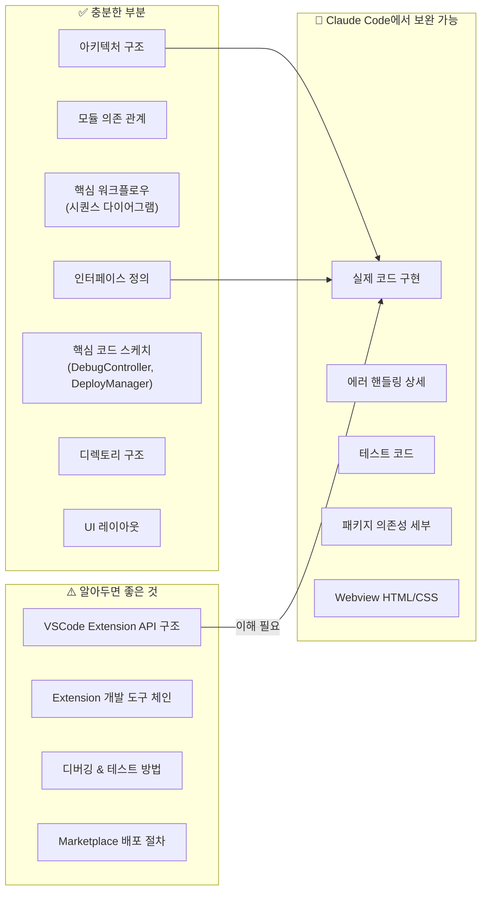
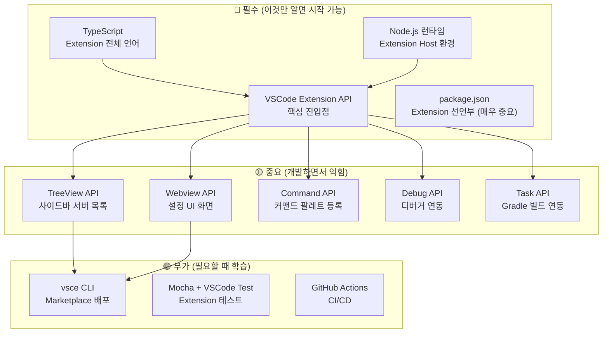
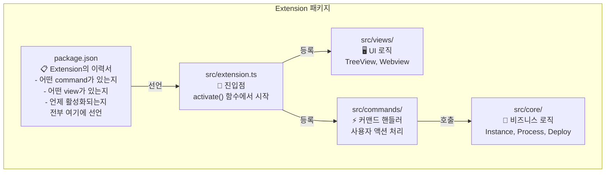
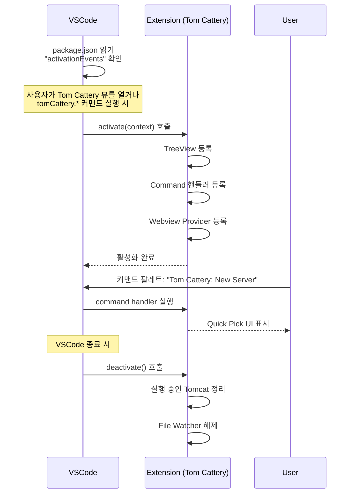
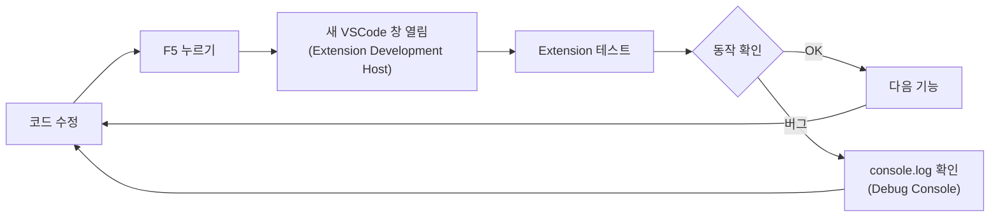
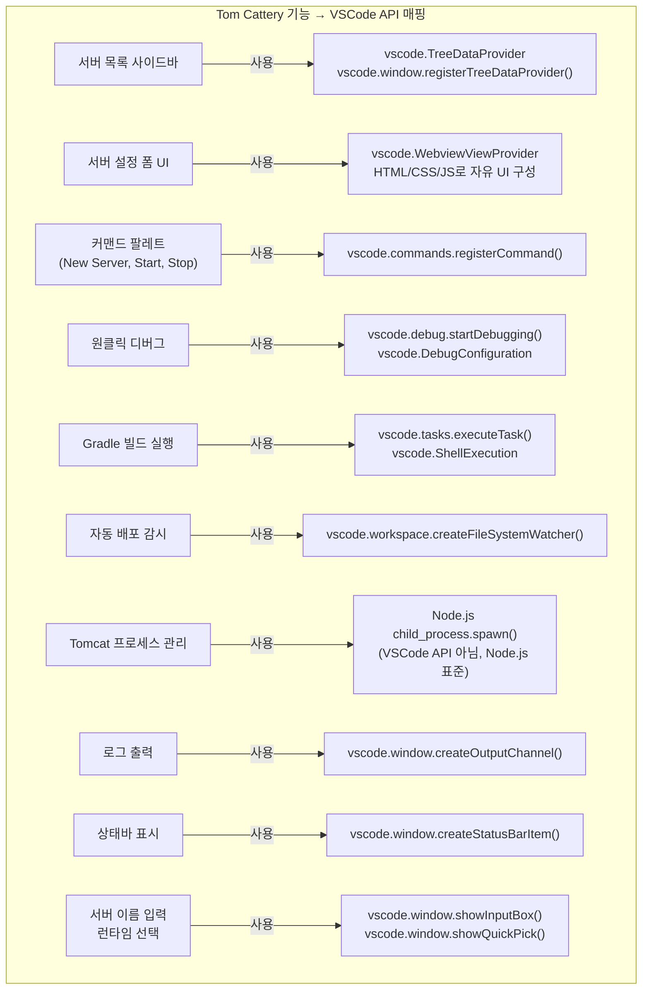
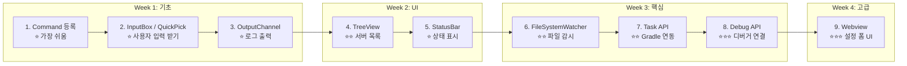
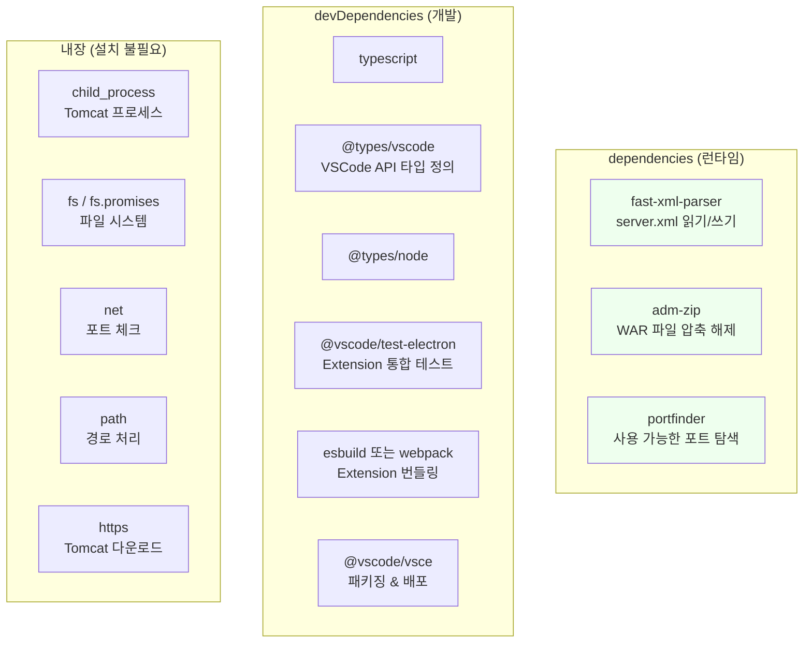
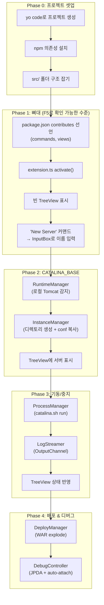
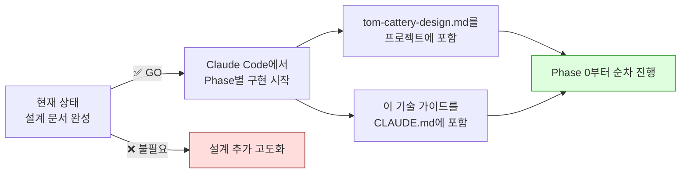

# Tom Cattery - 기술 스택 가이드 & 개발 전략

## 1. 현재 설계 문서 상태 평가



**결론: 설계 고도화보다 기술 스택 이해 → Claude Code 작업 시작이 효율적.**

---

## 2. VSCode Extension 개발 기술 스택 전체 지도

### 2.1 반드시 알아야 하는 것



### 2.2 기술 스택 상세

| 기술 | 용도 | Tom Cattery에서의 역할 | 학습 난이도 |
|------|------|----------------------|------------|
| **TypeScript** | Extension 구현 언어 | 모든 로직 | ⭐⭐ (JS 안다면 쉬움) |
| **Node.js** | Extension 실행 환경 | child_process, fs, net 등 | ⭐ |
| **VSCode Extension API** | Extension 기능 등록 | TreeView, Webview, Command, Debug | ⭐⭐⭐ |
| **package.json** | Extension 메타데이터 | command, view, keybinding 선언 | ⭐⭐ |
| **Webview (HTML/CSS/JS)** | 커스텀 UI | 서버 설정 폼 | ⭐⭐ |
| **XML 파서 (fast-xml-parser)** | server.xml 처리 | 포트 패치, 설정 편집 | ⭐ |
| **adm-zip** | WAR 파일 처리 | exploded 배포 | ⭐ |
| **vsce** | Marketplace 배포 도구 | .vsix 패키징 & 배포 | ⭐ |

---

## 3. VSCode Extension 핵심 개념 (5분 요약)

### 3.1 Extension 구조



### 3.2 Extension 생명주기



### 3.3 package.json이 왜 중요한가

VSCode Extension에서 `package.json`은 **단순한 의존성 파일이 아니라 Extension의 전체 선언부**이다.  
코드를 아무리 잘 짜도 여기에 선언하지 않으면 VSCode가 인식하지 못한다.

```
┌─────────────────────────────────────────────────┐
│  package.json의 역할                             │
├─────────────────────────────────────────────────┤
│                                                 │
│  일반 npm 프로젝트:                              │
│    package.json = 의존성 + 스크립트              │
│                                                 │
│  VSCode Extension:                              │
│    package.json = 의존성 + 스크립트              │
│                  + 모든 커맨드 선언              │
│                  + 모든 뷰(TreeView) 선언        │
│                  + 활성화 조건 선언              │
│                  + 키바인딩 선언                 │
│                  + 설정(configuration) 스키마     │
│                  + 메뉴/컨텍스트메뉴 선언        │
│                  + 아이콘/테마 선언              │
│                                                 │
│  → "contributes" 섹션이 Extension의 모든 것      │
└─────────────────────────────────────────────────┘
```

---

## 4. 개발 환경 셋업

### 4.1 필요한 도구

```bash
# 1. Node.js (LTS 권장)
node -v   # 18.x 이상

# 2. VSCode Extension 생성기
npm install -g yo generator-code

# 3. Extension 패키징/배포 도구
npm install -g @vscode/vsce

# 4. 프로젝트 생성
yo code
#   ? What type of extension? → New Extension (TypeScript)
#   ? Name? → tom-cattery
#   ? Identifier? → tom-cattery
#   ? Description? → 🐱 Tomcat Server Manager for VSCode
#   ? Initialize git? → Yes
#   ? Package manager? → npm
```

### 4.2 생성되는 프로젝트 구조

```
tom-cattery/
├── .vscode/
│   ├── launch.json          ← F5로 Extension 디버그 실행
│   └── tasks.json           ← 빌드 태스크
├── src/
│   └── extension.ts         ← 진입점 (여기서부터 확장)
├── package.json             ← ⭐ Extension 선언부
├── tsconfig.json            ← TypeScript 설정
└── .vscodeignore            ← 패키징 시 제외 파일
```

### 4.3 개발 & 디버그 사이클



> **F5를 누르면** 현재 Extension이 설치된 새로운 VSCode 창이 뜬다.  
> 이 창에서 Tom Cattery를 실제로 테스트할 수 있다.  
> **별도 설치 없이** 코드 수정 → F5 → 테스트 사이클이 바로 돈다.

---

## 5. Tom Cattery에서 쓰는 주요 VSCode API

### 5.1 API 의존 관계 맵



### 5.2 API별 난이도 & 학습 순서



---

## 6. npm 의존성 패키지

### 6.1 의존성 맵



### 6.2 package.json 의존성 예시

```json
{
  "dependencies": {
    "fast-xml-parser": "^4.3.0",
    "adm-zip": "^0.5.10",
    "portfinder": "^1.0.32"
  },
  "devDependencies": {
    "typescript": "^5.3.0",
    "@types/vscode": "^1.85.0",
    "@types/node": "^20.0.0",
    "@types/adm-zip": "^0.5.5",
    "@vscode/test-electron": "^2.3.0",
    "esbuild": "^0.19.0",
    "@vscode/vsce": "^2.22.0"
  }
}
```

> **의존성이 매우 적다.** 대부분 Node.js 내장 모듈로 처리 가능.  
> Extension은 가벼울수록 좋으므로 이점이다.

---

## 7. Claude Code 작업 전략

### 7.1 권장 작업 순서



### 7.2 Claude Code에 넘길 때 팁

```
📌 Claude Code 프롬프트 전략

1. 설계 문서를 CLAUDE.md 또는 프로젝트 루트에 넣기
   → Claude Code가 컨텍스트로 자동 참조

2. Phase별로 작업 지시
   → "Phase 1의 프로젝트 셋업과 빈 TreeView까지 구현해줘"
   → 한번에 전체를 시키면 품질이 떨어짐

3. F5 테스트 가능한 단위로 끊기
   → 각 Phase가 끝나면 직접 F5로 확인
   → "여기까지 되면 F5로 뭐가 보여야 해?" 확인

4. package.json을 먼저 확정하기
   → contributes 섹션이 Extension의 뼈대
   → 이걸 먼저 완성하고 코드를 채우는 게 효율적
```

### 7.3 각 Phase 완료 후 확인 포인트

| Phase | F5 눌렀을 때 확인할 것 |
|-------|---------------------|
| **Phase 1** | Activity Bar에 🐱 아이콘 보임, 클릭하면 빈 TreeView, 커맨드 팔레트에서 "Tom Cattery" 검색됨 |
| **Phase 2** | "New Server" → 이름/경로 입력 → `~/.vscode/tom-cattery/servers/` 에 디렉토리 생성됨, TreeView에 서버 표시 |
| **Phase 3** | TreeView에서 ▶ Start → Tomcat 기동 → Output Channel에 로그 출력 → ⏹ Stop으로 정지 |
| **Phase 4** | Deploy → webapps/에 exploded 배포됨, 🐛 Debug → 브레이크포인트 잡힘 |

---

## 8. 학습 자료 (필요할 때 참고)

| 자료 | URL | 용도 |
|------|-----|------|
| **VSCode Extension API 공식 문서** | https://code.visualstudio.com/api | 전체 레퍼런스 |
| **Your First Extension** | https://code.visualstudio.com/api/get-started/your-first-extension | 5분 퀵스타트 |
| **TreeView Guide** | https://code.visualstudio.com/api/extension-guides/tree-view | 사이드바 구현 |
| **Webview Guide** | https://code.visualstudio.com/api/extension-guides/webview | 커스텀 UI |
| **Debug Extension Guide** | https://code.visualstudio.com/api/extension-guides/debugger-extension | 디버거 연동 |
| **Extension Samples (GitHub)** | https://github.com/microsoft/vscode-extension-samples | 예제 코드 모음 |
| **Publishing Extensions** | https://code.visualstudio.com/api/working-with-extensions/publishing-extension | Marketplace 배포 |

> 💡 Claude Code에서 작업할 때 이 URL들을 직접 참조하라고 지시할 수 있다.

---

## 9. 결론: 바로 Claude Code로 가도 된다



**추가 설계가 필요하지 않은 이유:**
- 아키텍처, 인터페이스, 워크플로우가 이미 충분히 상세
- 핵심 코드 스케치(DebugController, DeployManager)가 구현 가이드 역할
- 나머지 상세 사항은 구현하면서 결정하는 게 더 효율적
- VSCode Extension API는 잘 문서화되어 있어서 Claude Code가 참조 가능

**Claude Code에 넘길 파일:**
1. `tom-cattery-design.md` — 설계 전체
2. 이 문서 (`tom-cattery-techstack-guide.md`) — 기술 스택 & 작업 전략
